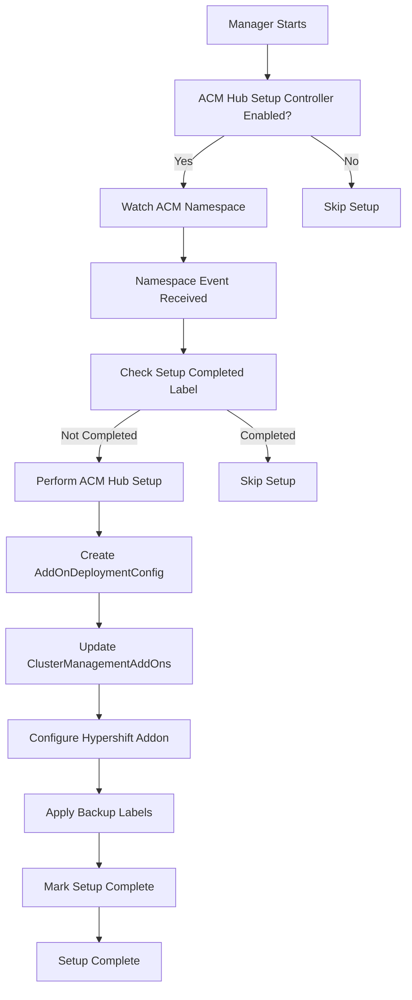

# ACM Hub Setup Controller

The ACM Hub Setup Controller automates the initial ACM hub configuration required for MCE hosted cluster discovery. This controller implements all the manual setup steps from the `docs/discovering_hostedclusters.md` documentation.

## Overview

The controller automatically configures the ACM hub when the hypershift-addon-operator starts, eliminating the need for manual setup scripts in most scenarios.

### What It Automates

The controller performs the following setup tasks automatically:

1. **AddOnDeploymentConfig Creation**: Creates `addon-ns-config` for proper namespace isolation
2. **ClusterManagementAddOn Updates**: Updates `work-manager`, `managed-serviceaccount`, and `cluster-proxy` addons
3. **KlusterletConfig Creation**: Creates configuration for MCE cluster imports (placeholder)
4. **Hypershift Addon Configuration**: Configures hypershift addon for discovery mode
5. **Backup Labels**: Applies disaster recovery labels to all created resources

## Architecture

### Controller Lifecycle



### Reconciliation Trigger

The controller watches for changes to the ACM namespace (default: `multicluster-engine`) and performs setup when:

- The namespace exists
- Setup completion label is not present: `hypershift.open-cluster-management.io/acm-hub-setup=true`

## Configuration

### Environment Variables

| Variable | Default | Description |
|----------|---------|-------------|
| `ENABLE_ACM_HUB_SETUP` | `true` | Enable/disable the ACM hub setup controller |
| `ADDON_NAMESPACE` | `open-cluster-management-agent-addon-discovery` | Namespace for addon installation |
| `ACM_NAMESPACE` | `multicluster-engine` | ACM/MCE namespace to watch |
| `POLICY_NAMESPACE` | `open-cluster-management-global-set` | Policy namespace |
| `BACKUP_ENABLED` | `true` | Apply backup labels for disaster recovery |

### Setup Components

#### 1. AddOnDeploymentConfig (`addon-ns-config`)

Creates configuration to install addons in the discovery namespace:

```yaml
apiVersion: addon.open-cluster-management.io/v1alpha1
kind: AddOnDeploymentConfig
metadata:
  name: addon-ns-config
  namespace: multicluster-engine
spec:
  agentInstallNamespace: open-cluster-management-agent-addon-discovery
```

#### 2. ClusterManagementAddOn Updates

Updates existing addons to reference the deployment config:

- `work-manager`
- `managed-serviceaccount` 
- `cluster-proxy`

Each addon gets updated with a config reference:

```yaml
spec:
  installStrategy:
    type: Placements
    placements:
    - name: global
      namespace: open-cluster-management-global-set
      configs:
      - group: addon.open-cluster-management.io
        name: addon-ns-config
        namespace: multicluster-engine
        resource: addondeploymentconfigs
```

#### 3. Hypershift Addon Configuration

Updates the `hypershift-addon-deploy-config` with discovery settings:

```yaml
spec:
  agentInstallNamespace: open-cluster-management-agent-addon-discovery
  customizedVariables:
  - name: disableMetrics
    value: "true"
  - name: disableHOManagement
    value: "true"
```

#### 4. Backup Labels

Applies `cluster.open-cluster-management.io/backup=true` to all created resources for disaster recovery.

## Usage

### Automatic Operation (Default)

The controller runs automatically when the manager starts:

```bash
# ACM hub setup happens automatically
./hypershift-addon-operator manager
```

### Disable ACM Hub Setup

```bash
export ENABLE_ACM_HUB_SETUP=false
./hypershift-addon-operator manager
```

### Custom Configuration

```bash
export ADDON_NAMESPACE=custom-addon-namespace
export BACKUP_ENABLED=false
./hypershift-addon-operator manager
```

## Monitoring

### Check Setup Status

Verify setup completion by checking the namespace label:

```bash
oc get namespace multicluster-engine --show-labels | grep acm-hub-setup
```

### View Controller Logs

```bash
oc logs -n multicluster-engine deployment/hypershift-addon-operator | grep "acm-hub-setup"
```

### Verify Created Resources

Check that resources were created properly:

```bash
# Check AddOnDeploymentConfig
oc get addondeploymentconfig addon-ns-config -n multicluster-engine

# Check ClusterManagementAddOn updates
oc get clustermanagementaddon work-manager -o yaml | grep -A 10 configs

# Check hypershift addon config
oc get addondeploymentconfig hypershift-addon-deploy-config -n multicluster-engine -o yaml
```

## Integration with Other Controllers

### Relationship with MCE Discovery Controller

1. **ACM Hub Setup Controller**: Runs first, sets up the global ACM configuration
2. **MCE Discovery Controller**: Runs after, handles individual MCE cluster setup

### Workflow

```
Manager Start
    ↓
ACM Hub Setup Controller
    ├── Creates global addon configs
    ├── Updates cluster management addons
    └── Configures hypershift addon
    ↓
MCE Discovery Controller
    ├── Watches for MCE clusters
    ├── Uses configs created by hub setup
    └── Enables discovery per cluster
    ↓
Discovery Process
    ├── Hypershift addons discover clusters
    ├── DiscoveredCluster resources created
    └── Auto-import policies trigger import
```

## Error Handling

### Common Issues

#### 1. Missing ClusterManagementAddOns

**Symptom**: Controller logs show addons not found
**Solution**: Ensure ACM/MCE is properly installed with required addons

#### 2. Permission Errors

**Symptom**: RBAC errors in controller logs
**Solution**: Verify service account has required permissions for addon resources

#### 3. Hypershift Addon Config Not Found

**Symptom**: "Hypershift addon deployment config not found" in logs
**Solution**: Normal if hypershift addon isn't deployed yet - controller will skip this step

### Recovery

If setup fails or needs to be re-run:

1. **Remove completion label**:
   ```bash
   oc label namespace multicluster-engine hypershift.open-cluster-management.io/acm-hub-setup-
   ```

2. **Restart controller**:
   ```bash
   oc rollout restart deployment/hypershift-addon-operator -n multicluster-engine
   ```

## Comparison with Shell Scripts

| Aspect | ACM Hub Setup Controller | Shell Scripts |
|--------|-------------------------|---------------|
| **Execution** | Automatic on startup | Manual execution |
| **Idempotency** | Built-in | Manual checking |
| **Error Handling** | Automatic retry | Manual intervention |
| **Monitoring** | Kubernetes events/logs | Script output |
| **Maintenance** | Self-healing | Re-run required |
| **Complex Policies** | Limited | Full support |

### When to Use Each

**Use the Controller for**:
- Standard ACM hub setup
- Automated deployments
- Self-healing environments
- Production operations

**Use the Shell Scripts for**:
- Complex policy deployment
- Custom configurations
- One-time setups
- Troubleshooting

## Future Enhancements

The controller can be extended to support:

1. **Policy Management**: Create and manage auto-import policies
2. **Validation**: Validate ACM hub readiness before setup
3. **Metrics**: Export setup and health metrics
4. **Custom Resources**: Support for custom addon configurations
5. **Multi-tenancy**: Support for multiple ACM hubs

## Troubleshooting Guide

### Setup Not Triggered

1. Check if controller is enabled:
   ```bash
   echo $ENABLE_ACM_HUB_SETUP
   ```

2. Verify namespace exists:
   ```bash
   oc get namespace multicluster-engine
   ```

3. Check controller logs:
   ```bash
   oc logs -n multicluster-engine deployment/hypershift-addon-operator | grep "acm-hub-setup"
   ```

### Setup Incomplete

1. Check for errors in logs:
   ```bash
   oc logs -n multicluster-engine deployment/hypershift-addon-operator | grep -i error
   ```

2. Verify resource creation:
   ```bash
   oc get addondeploymentconfig -n multicluster-engine
   oc get clustermanagementaddon
   ```

3. Check RBAC permissions:
   ```bash
   oc auth can-i create addondeploymentconfig --as=system:serviceaccount:multicluster-engine:hypershift-addon-operator
   ```

The ACM Hub Setup Controller provides automated, reliable setup of the ACM hub configuration, reducing manual effort and ensuring consistent deployments across environments.
