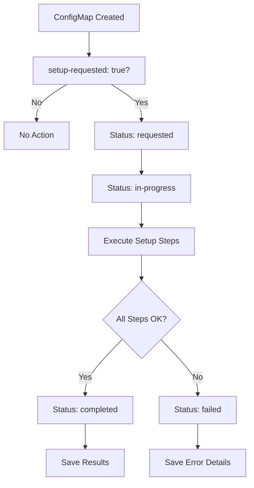

# ConfigMap-Triggered ACM Hub Setup

The ACM Hub Setup Controller has been enhanced to trigger setup based on a specific ConfigMap creation, providing explicit control over when the setup runs and detailed tracking of results.

## Overview

Instead of automatically running on namespace events, the controller now:

1. **Watches for a specific ConfigMap** (`acm-hub-setup-trigger`)
2. **Triggers setup** when `setup-requested: "true"` is set
3. **Tracks detailed progress** for each setup step
4. **Saves results** back to the ConfigMap in JSON format
5. **Provides status updates** throughout the process

## Usage

### 1. Trigger Setup

Create the trigger ConfigMap to start the ACM hub setup:

```bash
kubectl apply -f - <<EOF
apiVersion: v1
kind: ConfigMap
metadata:
  name: acm-hub-setup-trigger
  namespace: multicluster-engine
data:
  setup-requested: "true"
  setup-reason: "Initial ACM hub configuration"
  requested-by: "admin"
EOF
```

### 2. Monitor Progress

Watch the ConfigMap for status updates:

```bash
# Watch for status changes
kubectl get configmap acm-hub-setup-trigger -n multicluster-engine -o yaml -w

# Check current status
kubectl get configmap acm-hub-setup-trigger -n multicluster-engine -o jsonpath='{.data.setup-status}'

# View detailed results
kubectl get configmap acm-hub-setup-trigger -n multicluster-engine -o jsonpath='{.data.setup-results}' | jq .
```

### 3. Check Controller Logs

Monitor controller activity:

```bash
kubectl logs -n multicluster-engine deployment/hypershift-addon-operator | grep "acm-hub-setup"
```

## ConfigMap Structure

### Input Fields

| Field | Required | Description |
|-------|----------|-------------|
| `setup-requested` | Yes | Set to `"true"` to trigger setup |
| `setup-reason` | No | Description of why setup is needed |
| `requested-by` | No | Who requested the setup |

### Status Fields (Populated by Controller)

| Field | Description |
|-------|-------------|
| `setup-status` | Current status: `requested`, `in-progress`, `completed`, `failed` |
| `setup-timestamp` | Last update timestamp |
| `setup-message` | Human-readable status message |
| `setup-results` | Detailed JSON results of all setup steps |
| `setup-error` | Error message if setup failed |

## Setup Process

### Status Flow



### Setup Steps Tracked

1. **addon-deployment-config**: Creates `addon-ns-config`
2. **cluster-management-addon-work-manager**: Updates work-manager addon
3. **cluster-management-addon-managed-serviceaccount**: Updates managed-serviceaccount addon
4. **cluster-management-addon-cluster-proxy**: Updates cluster-proxy addon
5. **klusterlet-config**: Creates klusterlet configuration (placeholder)
6. **hypershift-addon-config**: Configures hypershift addon for discovery
7. **backup-labels**: Applies disaster recovery labels

## Results Format

The `setup-results` field contains a JSON object with detailed information:

```json
{
  "overallStatus": "completed",
  "startTime": "2024-01-15T10:30:15Z",
  "endTime": "2024-01-15T10:30:45Z", 
  "duration": "30s",
  "summary": "ACM hub setup completed successfully",
  "results": [
    {
      "component": "addon-deployment-config",
      "status": "completed",
      "message": "Successfully configured addon-deployment-config",
      "timestamp": "2024-01-15T10:30:18Z"
    }
    // ... more results
  ]
}
```

## Example Workflows

### Basic Setup

```bash
# 1. Trigger setup
kubectl create configmap acm-hub-setup-trigger -n multicluster-engine \
  --from-literal=setup-requested=true \
  --from-literal=setup-reason="Initial setup"

# 2. Wait for completion
kubectl wait --for=jsonpath='{.data.setup-status}'=completed \
  configmap/acm-hub-setup-trigger -n multicluster-engine --timeout=300s

# 3. Check results
kubectl get configmap acm-hub-setup-trigger -n multicluster-engine \
  -o jsonpath='{.data.setup-results}' | jq '.summary'
```

### Monitor with Polling

```bash
#!/bin/bash
while true; do
  STATUS=$(kubectl get configmap acm-hub-setup-trigger -n multicluster-engine \
    -o jsonpath='{.data.setup-status}' 2>/dev/null)
  
  echo "Setup status: ${STATUS:-not-found}"
  
  if [[ "$STATUS" == "completed" ]] || [[ "$STATUS" == "failed" ]]; then
    echo "Setup finished with status: $STATUS"
    break
  fi
  
  sleep 5
done
```

### Re-trigger Setup

To run setup again (e.g., after configuration changes):

```bash
# 1. Delete existing ConfigMap
kubectl delete configmap acm-hub-setup-trigger -n multicluster-engine

# 2. Create new trigger
kubectl create configmap acm-hub-setup-trigger -n multicluster-engine \
  --from-literal=setup-requested=true \
  --from-literal=setup-reason="Re-run after configuration update"
```

## Error Handling

### Common Scenarios

#### 1. Setup Already Completed

If you try to trigger setup when it's already completed:

```yaml
data:
  setup-status: "completed"
  setup-message: "Setup already completed"
```

The controller will not re-run the setup. Delete and recreate the ConfigMap to force a re-run.

#### 2. Setup Failed

If setup fails, the ConfigMap will show:

```yaml
data:
  setup-status: "failed"
  setup-error: "Setup failed: failed to update ClusterManagementAddOn work-manager: ..."
  setup-results: |
    {
      "overallStatus": "failed",
      "summary": "Setup failed: ...",
      "results": [
        {
          "component": "addon-deployment-config",
          "status": "completed",
          "message": "Successfully configured addon-deployment-config"
        },
        {
          "component": "cluster-management-addon-work-manager", 
          "status": "failed",
          "error": "ClusterManagementAddOn not found",
          "message": "Failed to setup cluster-management-addon-work-manager"
        }
      ]
    }
```

#### 3. Setup In Progress

If setup is already running:

```yaml
data:
  setup-status: "in-progress"
  setup-message: "Starting ACM hub setup"
```

The controller will not start another setup process. Wait for completion or delete the ConfigMap to reset.

## Troubleshooting

### Check Controller Status

```bash
# Verify controller is running
kubectl get pods -n multicluster-engine -l app=hypershift-addon-operator

# Check controller logs
kubectl logs -n multicluster-engine deployment/hypershift-addon-operator \
  | grep "acm-hub-setup-controller"
```

### Validate Permissions

```bash
# Check if controller can update ConfigMaps
kubectl auth can-i update configmaps \
  --as=system:serviceaccount:multicluster-engine:hypershift-addon-operator \
  -n multicluster-engine

# Check addon permissions
kubectl auth can-i create addondeploymentconfigs \
  --as=system:serviceaccount:multicluster-engine:hypershift-addon-operator \
  -n multicluster-engine
```

### Debug Setup Steps

View detailed results to identify which step failed:

```bash
# Get detailed results
kubectl get configmap acm-hub-setup-trigger -n multicluster-engine \
  -o jsonpath='{.data.setup-results}' | jq '.results[] | select(.status == "failed")'

# Check specific resources
kubectl get addondeploymentconfig addon-ns-config -n multicluster-engine
kubectl get clustermanagementaddon work-manager -o yaml
```

## Integration with Shell Scripts

The ConfigMap-triggered approach complements the existing shell scripts:

| Approach | Best For | Advantages |
|----------|----------|------------|
| **ConfigMap Controller** | Kubernetes-native workflows, GitOps, automated deployments | Declarative, trackable, integrated |
| **Shell Scripts** | Manual setup, troubleshooting, complex policies | Full control, immediate feedback, comprehensive |

### Migration from Automatic Mode

If you were using the automatic namespace-watching mode:

1. **Disable automatic mode**:
   ```bash
   export ENABLE_ACM_HUB_SETUP=false
   ```

2. **Use ConfigMap trigger**:
   ```bash
   kubectl apply -f automation/examples/acm-hub-setup-trigger.yaml
   ```

## Advanced Usage

### Custom Configuration

Pass custom settings through the ConfigMap:

```yaml
apiVersion: v1
kind: ConfigMap
metadata:
  name: acm-hub-setup-trigger
  namespace: multicluster-engine
data:
  setup-requested: "true"
  # Custom settings (read by controller if implemented)
  addon-namespace: "custom-addon-namespace"
  backup-enabled: "false"
  timeout: "600"
```

### GitOps Integration

Include the trigger ConfigMap in your GitOps repository:

```yaml
# kustomization.yaml
resources:
  - acm-hub-setup-trigger.yaml

# Apply via ArgoCD, Flux, etc.
```

### Automation Scripts

Integrate with CI/CD pipelines:

```bash
#!/bin/bash
# deploy-acm-hub.sh

echo "Triggering ACM hub setup..."
kubectl apply -f acm-hub-setup-trigger.yaml

echo "Waiting for setup completion..."
kubectl wait --for=jsonpath='{.data.setup-status}'=completed \
  configmap/acm-hub-setup-trigger -n multicluster-engine --timeout=600s

if [[ $? -eq 0 ]]; then
  echo "ACM hub setup completed successfully"
  kubectl get configmap acm-hub-setup-trigger -n multicluster-engine \
    -o jsonpath='{.data.setup-results}' | jq '.summary'
else
  echo "ACM hub setup failed or timed out"
  kubectl get configmap acm-hub-setup-trigger -n multicluster-engine \
    -o jsonpath='{.data.setup-error}'
  exit 1
fi
```

The ConfigMap-triggered approach provides explicit control, detailed tracking, and seamless integration with Kubernetes-native workflows while maintaining all the automation benefits of the controller.
