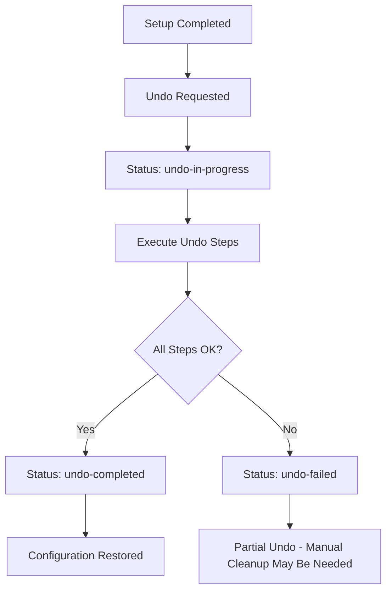

# Undo ACM Hub Configuration

The ACM Hub Setup Controller now supports undoing the configuration changes it made, providing a clean way to reverse the setup when needed.

## Overview

The undo functionality allows you to:

- **Reverse all setup changes** made by the controller
- **Restore original configurations** for ClusterManagementAddOns
- **Clean up created resources** like AddOnDeploymentConfigs
- **Remove backup labels** applied during setup
- **Track undo progress** with detailed results

## How Undo Works

### Undo Process

The undo operation reverses the setup steps in the following order:

1. **Remove Backup Labels**: Removes disaster recovery labels from resources
2. **Restore Hypershift Addon**: Resets hypershift addon to original configuration
3. **Restore ClusterManagementAddOns**: Removes our config references from addons
4. **Delete AddOnDeploymentConfig**: Removes the `addon-ns-config` we created
5. **Delete KlusterletConfig**: Removes klusterlet configuration (placeholder)

### Status Flow



## Usage

### Method 1: Using the Convenience Script

#### Trigger Undo
```bash
# Basic undo
./automation/scripts/trigger-acm-hub-setup.sh --undo

# With custom reason
./automation/scripts/trigger-acm-hub-setup.sh --undo --undo-reason "Cleanup before reconfiguration"

# Don't wait for completion
./automation/scripts/trigger-acm-hub-setup.sh --undo --no-wait

# Dry run to see what would be done
./automation/scripts/trigger-acm-hub-setup.sh --undo --dry-run
```

#### Monitor Progress
```bash
# Check status
./automation/scripts/trigger-acm-hub-setup.sh --status

# Watch ConfigMap changes
kubectl get configmap acm-hub-setup-trigger -n multicluster-engine -o yaml -w

# View detailed undo results
kubectl get configmap acm-hub-setup-trigger -n multicluster-engine \
  -o jsonpath='{.data.setup-results}' | jq .
```

### Method 2: Direct ConfigMap Update

#### Patch Existing ConfigMap
```bash
kubectl patch configmap acm-hub-setup-trigger -n multicluster-engine \
  --type=merge -p='{
    "data": {
      "undo-requested": "true",
      "undo-reason": "Cleanup ACM hub configuration",
      "undo-requested-by": "admin"
    }
  }'
```

#### Create New ConfigMap with Undo Request
```bash
kubectl apply -f - <<EOF
apiVersion: v1
kind: ConfigMap
metadata:
  name: acm-hub-setup-trigger
  namespace: multicluster-engine
data:
  setup-requested: "true"
  setup-status: "completed"
  undo-requested: "true"
  undo-reason: "Manual cleanup request"
  undo-requested-by: "platform-admin"
EOF
```

## Undo Results

The undo process provides detailed tracking similar to setup:

```json
{
  "overallStatus": "undo-completed",
  "startTime": "2024-01-15T15:30:45Z",
  "endTime": "2024-01-15T15:32:15Z",
  "duration": "1m30s",
  "summary": "ACM hub undo completed successfully",
  "results": [
    {
      "component": "remove-backup-labels",
      "status": "completed",
      "message": "Successfully configured remove-backup-labels",
      "timestamp": "2024-01-15T15:30:50Z"
    },
    {
      "component": "restore-hypershift-addon-config",
      "status": "completed",
      "message": "Successfully configured restore-hypershift-addon-config",
      "timestamp": "2024-01-15T15:31:05Z"
    },
    {
      "component": "restore-cluster-management-addon-work-manager",
      "status": "completed",
      "message": "Successfully configured restore-cluster-management-addon-work-manager",
      "timestamp": "2024-01-15T15:31:25Z"
    },
    {
      "component": "delete-addon-deployment-config",
      "status": "completed",
      "message": "Successfully configured delete-addon-deployment-config",
      "timestamp": "2024-01-15T15:32:10Z"
    }
  ]
}
```

## What Gets Undone

### 1. AddOnDeploymentConfig Deletion
- **Resource**: `addon-ns-config` in multicluster-engine namespace
- **Action**: Complete deletion
- **Result**: Addons return to default installation behavior

### 2. ClusterManagementAddOn Restoration
For each addon (`work-manager`, `managed-serviceaccount`, `cluster-proxy`):
- **Action**: Remove our config reference from placement configs
- **Result**: Addons no longer use our custom namespace configuration

### 3. Hypershift Addon Restoration
- **Namespace**: Reset `agentInstallNamespace` to default (empty)
- **Variables**: Remove `disableMetrics` and `disableHOManagement`
- **Result**: Hypershift addon returns to original configuration

### 4. Backup Label Removal
- **Resources**: All resources that had backup labels applied
- **Action**: Remove `cluster.open-cluster-management.io/backup=true` label
- **Result**: Resources no longer included in backup/restore

### 5. KlusterletConfig Deletion
- **Resource**: `mce-import-klusterlet-config` (placeholder)
- **Action**: Would delete the klusterlet configuration
- **Status**: Currently placeholder - no actual deletion

## Prerequisites for Undo

### Required Status
Undo can only be triggered when:
- Setup status is `completed`
- Setup status is `undo-failed` (retry)

### Prevented Scenarios
Undo is **not allowed** when:
- Setup status is `in-progress`
- Setup status is `failed`
- Setup status is `undo-in-progress`
- Setup status is `undo-completed`
- No setup ConfigMap exists

### Error Handling
The undo process is designed to be **resilient**:
- Individual step failures don't stop the entire undo
- Missing resources are handled gracefully
- Permission errors are logged but don't fail the process
- Detailed error information is provided for troubleshooting

## Verification After Undo

### Check Resource Cleanup
```bash
# Verify AddOnDeploymentConfig is deleted
kubectl get addondeploymentconfig addon-ns-config -n multicluster-engine
# Should return: Error from server (NotFound)

# Check ClusterManagementAddOns no longer reference our config
kubectl get clustermanagementaddon work-manager -o yaml | grep -A 5 configs
# Should not show addon-ns-config reference

# Verify hypershift addon config is restored
kubectl get addondeploymentconfig hypershift-addon-deploy-config -n multicluster-engine -o yaml
# Should not show discovery-specific variables
```

### Verify Backup Labels Removed
```bash
# Check that backup labels are removed
kubectl get clustermanagementaddon work-manager -o yaml | grep backup
# Should return no results
```

## Common Use Cases

### 1. Reconfiguration
```bash
# Undo current setup
./automation/scripts/trigger-acm-hub-setup.sh --undo --undo-reason "Reconfiguration"

# Wait for completion
kubectl wait --for=jsonpath='{.data.setup-status}'=undo-completed \
  configmap/acm-hub-setup-trigger -n multicluster-engine --timeout=300s

# Apply new setup
./automation/scripts/trigger-acm-hub-setup.sh --reason "New configuration"
```

### 2. Environment Cleanup
```bash
# Clean up development environment
./automation/scripts/trigger-acm-hub-setup.sh --undo --undo-reason "Dev environment cleanup"
```

### 3. Troubleshooting
```bash
# Undo to restore original state for debugging
./automation/scripts/trigger-acm-hub-setup.sh --undo --undo-reason "Troubleshooting setup issues"
```

### 4. Disaster Recovery Testing
```bash
# Test backup/restore by undoing and redoing setup
./automation/scripts/trigger-acm-hub-setup.sh --undo --undo-reason "DR testing"
# ... test restore procedures ...
./automation/scripts/trigger-acm-hub-setup.sh --reason "DR test restoration"
```

## Troubleshooting Undo

### Undo Failed
If undo fails, check the detailed results:

```bash
# Get failed steps
kubectl get configmap acm-hub-setup-trigger -n multicluster-engine \
  -o jsonpath='{.data.setup-results}' | jq '.results[] | select(.status == "failed")'

# Check specific resources
kubectl get addondeploymentconfig -n multicluster-engine
kubectl get clustermanagementaddon work-manager -o yaml
```

### Manual Cleanup
If automatic undo fails, you can manually clean up:

```bash
# Delete AddOnDeploymentConfig
kubectl delete addondeploymentconfig addon-ns-config -n multicluster-engine

# Remove config references from ClusterManagementAddOns
kubectl patch clustermanagementaddon work-manager --type=json \
  -p='[{"op": "remove", "path": "/spec/installStrategy/placements/0/configs"}]'

# Reset hypershift addon config
kubectl patch addondeploymentconfig hypershift-addon-deploy-config -n multicluster-engine \
  --type=json -p='[
    {"op": "replace", "path": "/spec/agentInstallNamespace", "value": ""},
    {"op": "remove", "path": "/spec/customizedVariables"}
  ]'
```

### Permission Issues
Ensure the controller service account has delete permissions:

```bash
kubectl auth can-i delete addondeploymentconfig \
  --as=system:serviceaccount:multicluster-engine:hypershift-addon-operator \
  -n multicluster-engine
```

## Limitations

### Current Limitations
1. **KlusterletConfig**: Currently placeholder - no actual deletion
2. **Partial Failures**: Individual step failures don't stop the process
3. **External Dependencies**: Cannot undo changes made by other systems
4. **Timing**: Cannot undo while setup is in progress

### Future Enhancements
1. **Confirmation Prompts**: Add confirmation for destructive operations
2. **Selective Undo**: Allow undoing specific components only
3. **Backup Creation**: Create backups before making changes
4. **Rollback**: Support rolling back to specific previous configurations

The undo functionality provides a safe and trackable way to reverse ACM hub setup changes, making it easier to manage configuration lifecycle and troubleshoot issues.
