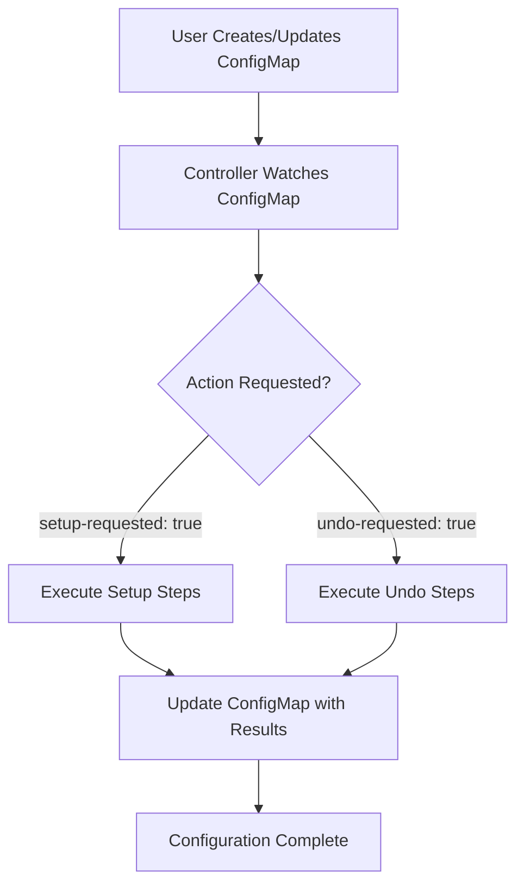
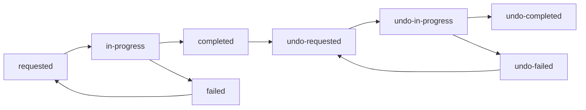

# ACM Hub Configuration Management via ConfigMap

This document explains how to use ConfigMaps to configure and undo ACM hub setup for MCE hosted cluster discovery. The hypershift-addon-operator includes a ConfigMap-triggered controller that automates ACM hub configuration with detailed tracking and undo capabilities.

## Overview

The ACM Hub Setup Controller provides a declarative way to manage ACM hub configuration through a special ConfigMap. This approach offers:

- **Explicit Control**: Setup only runs when explicitly requested
- **Detailed Tracking**: Complete audit trail of all configuration changes
- **Undo Functionality**: Safe reversal of configuration changes
- **GitOps Compatible**: ConfigMap can be version controlled
- **Status Visibility**: Real-time status and progress tracking

## Architecture



## ConfigMap Structure

### Core Fields

| Field | Purpose | Required | Values |
|-------|---------|----------|---------|
| `setup-requested` | Trigger setup | Yes (for setup) | `"true"` or `"false"` |
| `undo-requested` | Trigger undo | Yes (for undo) | `"true"` or `"false"` |
| `setup-reason` | Setup justification | No | Any descriptive text |
| `undo-reason` | Undo justification | No | Any descriptive text |
| `requested-by` | User identification | No | Username or identifier |

### Status Fields (Populated by Controller)

| Field | Description | Example Values |
|-------|-------------|----------------|
| `setup-status` | Current operation status | `requested`, `in-progress`, `completed`, `failed`, `undo-completed` |
| `setup-timestamp` | Last update time | `2024-01-15T10:30:45Z` |
| `setup-message` | Human-readable status | `"Setup completed successfully"` |
| `setup-results` | Detailed JSON results | Complete operation results |
| `setup-error` | Error details (if failed) | Error message and details |

## Setup Configuration

### Basic Setup

Create a ConfigMap to trigger ACM hub setup:

```yaml
apiVersion: v1
kind: ConfigMap
metadata:
  name: acm-hub-setup-trigger
  namespace: multicluster-engine
  labels:
    app: hypershift-addon-operator
    component: acm-hub-setup
data:
  setup-requested: "true"
  setup-reason: "Initial ACM hub configuration for MCE discovery"
  requested-by: "platform-admin"
```

### Apply the Configuration

```bash
kubectl apply -f - <<EOF
apiVersion: v1
kind: ConfigMap
metadata:
  name: acm-hub-setup-trigger
  namespace: multicluster-engine
data:
  setup-requested: "true"
  setup-reason: "Production deployment setup"
  requested-by: "$(whoami)"
EOF
```

### Monitor Setup Progress

```bash
# Watch ConfigMap for real-time updates
kubectl get configmap acm-hub-setup-trigger -n multicluster-engine -o yaml -w

# Check current status
kubectl get configmap acm-hub-setup-trigger -n multicluster-engine \
  -o jsonpath='{.data.setup-status}'

# Wait for completion
kubectl wait --for=jsonpath='{.data.setup-status}'=completed \
  configmap/acm-hub-setup-trigger -n multicluster-engine --timeout=600s
```

## Setup Process Details

### What Gets Configured

The setup process performs these steps:

1. **AddOnDeploymentConfig Creation**
   - Creates `addon-ns-config` in multicluster-engine namespace
   - Configures addon installation namespace isolation

2. **ClusterManagementAddOn Updates**
   - Updates `work-manager`, `managed-serviceaccount`, `cluster-proxy`
   - Adds references to the deployment config for proper namespace handling

3. **Hypershift Addon Configuration**
   - Updates `hypershift-addon-deploy-config`
   - Sets discovery-specific variables (`disableMetrics`, `disableHOManagement`)
   - Configures addon installation namespace

4. **Backup Label Application**
   - Applies `cluster.open-cluster-management.io/backup=true` labels
   - Enables disaster recovery for created/modified resources

### Setup Results Example

After successful setup, the ConfigMap contains detailed results:

```yaml
data:
  setup-status: "completed"
  setup-timestamp: "2024-01-15T10:30:45Z"
  setup-message: "Setup completed successfully"
  setup-results: |
    {
      "overallStatus": "completed",
      "startTime": "2024-01-15T10:30:15Z",
      "endTime": "2024-01-15T10:30:45Z",
      "duration": "30s",
      "summary": "ACM hub setup completed successfully",
      "results": [
        {
          "component": "addon-deployment-config",
          "status": "completed",
          "message": "Successfully configured addon-deployment-config",
          "timestamp": "2024-01-15T10:30:18Z"
        },
        {
          "component": "cluster-management-addon-work-manager",
          "status": "completed",
          "message": "Successfully configured cluster-management-addon-work-manager",
          "timestamp": "2024-01-15T10:30:22Z"
        },
        {
          "component": "hypershift-addon-config",
          "status": "completed",
          "message": "Successfully configured hypershift-addon-config",
          "timestamp": "2024-01-15T10:30:38Z"
        }
      ]
    }
```

## Undo Configuration

### When to Use Undo

Undo the ACM hub configuration when you need to:
- **Reconfigure**: Apply different settings
- **Troubleshoot**: Restore original state for debugging
- **Clean up**: Remove configuration for environment cleanup
- **Test**: Verify backup/restore procedures

### Trigger Undo

#### Method 1: Patch Existing ConfigMap

```bash
kubectl patch configmap acm-hub-setup-trigger -n multicluster-engine \
  --type=merge -p='{
    "data": {
      "undo-requested": "true",
      "undo-reason": "Cleanup before reconfiguration",
      "undo-requested-by": "platform-admin"
    }
  }'
```

#### Method 2: Replace ConfigMap

```yaml
apiVersion: v1
kind: ConfigMap
metadata:
  name: acm-hub-setup-trigger
  namespace: multicluster-engine
data:
  # Keep original setup info for audit trail
  setup-requested: "true"
  setup-status: "completed"
  
  # Add undo request
  undo-requested: "true"
  undo-reason: "Manual cleanup request"
  undo-requested-by: "admin"
```

### Monitor Undo Progress

```bash
# Watch undo progress
kubectl get configmap acm-hub-setup-trigger -n multicluster-engine -o yaml -w

# Check undo status
kubectl get configmap acm-hub-setup-trigger -n multicluster-engine \
  -o jsonpath='{.data.setup-status}'

# Wait for undo completion
kubectl wait --for=jsonpath='{.data.setup-status}'=undo-completed \
  configmap/acm-hub-setup-trigger -n multicluster-engine --timeout=600s
```

## Undo Process Details

### What Gets Undone

The undo process reverses setup changes:

1. **Remove Backup Labels**
   - Removes `cluster.open-cluster-management.io/backup=true` from resources
   - Resources no longer included in backup/restore

2. **Restore Hypershift Addon Configuration**
   - Resets `agentInstallNamespace` to default
   - Removes discovery-specific variables
   - Restores original hypershift addon behavior

3. **Restore ClusterManagementAddOns**
   - Removes our config references from addon placements
   - Addons return to default installation behavior

4. **Delete AddOnDeploymentConfig**
   - Removes `addon-ns-config` completely
   - Eliminates custom namespace configuration

5. **Delete KlusterletConfig**
   - Removes klusterlet configuration (placeholder)

### Undo Results Example

After successful undo:

```yaml
data:
  setup-status: "undo-completed"
  setup-timestamp: "2024-01-15T15:32:15Z"
  setup-message: "Undo completed successfully"
  setup-results: |
    {
      "overallStatus": "undo-completed",
      "startTime": "2024-01-15T15:30:45Z",
      "endTime": "2024-01-15T15:32:15Z",
      "duration": "1m30s",
      "summary": "ACM hub undo completed successfully",
      "results": [
        {
          "component": "remove-backup-labels",
          "status": "completed",
          "message": "Successfully configured remove-backup-labels",
          "timestamp": "2024-01-15T15:30:50Z"
        },
        {
          "component": "delete-addon-deployment-config",
          "status": "completed",
          "message": "Successfully configured delete-addon-deployment-config",
          "timestamp": "2024-01-15T15:32:10Z"
        }
      ]
    }
```

## Status Values and Transitions

### Setup Status Flow



### Status Descriptions

| Status | Description | Next Actions |
|--------|-------------|--------------|
| `requested` | Setup has been requested | Controller will start setup |
| `in-progress` | Setup is currently running | Wait for completion |
| `completed` | Setup finished successfully | Can trigger undo or leave as-is |
| `failed` | Setup failed with errors | Check errors, fix issues, retry |
| `undo-requested` | Undo has been requested | Controller will start undo |
| `undo-in-progress` | Undo is currently running | Wait for completion |
| `undo-completed` | Undo finished successfully | Can trigger new setup |
| `undo-failed` | Undo failed with errors | Check errors, fix issues, retry |

## Common Workflows

### Initial Setup Workflow

```bash
# 1. Create setup ConfigMap
kubectl apply -f - <<EOF
apiVersion: v1
kind: ConfigMap
metadata:
  name: acm-hub-setup-trigger
  namespace: multicluster-engine
data:
  setup-requested: "true"
  setup-reason: "Initial production setup"
  requested-by: "$(whoami)"
EOF

# 2. Monitor progress
kubectl get configmap acm-hub-setup-trigger -n multicluster-engine -o yaml -w

# 3. Verify completion
kubectl get configmap acm-hub-setup-trigger -n multicluster-engine \
  -o jsonpath='{.data.setup-status}'
```

### Reconfiguration Workflow

```bash
# 1. Undo current configuration
kubectl patch configmap acm-hub-setup-trigger -n multicluster-engine \
  --type=merge -p='{
    "data": {
      "undo-requested": "true",
      "undo-reason": "Reconfiguration needed"
    }
  }'

# 2. Wait for undo completion
kubectl wait --for=jsonpath='{.data.setup-status}'=undo-completed \
  configmap/acm-hub-setup-trigger -n multicluster-engine --timeout=600s

# 3. Delete and recreate ConfigMap with new configuration
kubectl delete configmap acm-hub-setup-trigger -n multicluster-engine

kubectl apply -f - <<EOF
apiVersion: v1
kind: ConfigMap
metadata:
  name: acm-hub-setup-trigger
  namespace: multicluster-engine
data:
  setup-requested: "true"
  setup-reason: "New configuration applied"
  requested-by: "$(whoami)"
EOF
```

### Troubleshooting Workflow

```bash
# 1. Check current status
kubectl get configmap acm-hub-setup-trigger -n multicluster-engine \
  -o jsonpath='{.data.setup-status}'

# 2. View detailed results
kubectl get configmap acm-hub-setup-trigger -n multicluster-engine \
  -o jsonpath='{.data.setup-results}' | jq .

# 3. If setup failed, check error details
kubectl get configmap acm-hub-setup-trigger -n multicluster-engine \
  -o jsonpath='{.data.setup-error}'

# 4. Undo to restore clean state for debugging
kubectl patch configmap acm-hub-setup-trigger -n multicluster-engine \
  --type=merge -p='{
    "data": {
      "undo-requested": "true",
      "undo-reason": "Troubleshooting - restore clean state"
    }
  }'
```

## Verification Commands

### Verify Setup Success

```bash
# Check that AddOnDeploymentConfig was created
kubectl get addondeploymentconfig addon-ns-config -n multicluster-engine

# Verify ClusterManagementAddOns reference our config
kubectl get clustermanagementaddon work-manager -o yaml | grep -A 10 configs

# Check hypershift addon configuration
kubectl get addondeploymentconfig hypershift-addon-deploy-config -n multicluster-engine \
  -o jsonpath='{.spec.agentInstallNamespace}'

# Verify backup labels were applied
kubectl get clustermanagementaddon work-manager \
  -o jsonpath='{.metadata.labels.cluster\.open-cluster-management\.io/backup}'
```

### Verify Undo Success

```bash
# Verify AddOnDeploymentConfig was deleted
kubectl get addondeploymentconfig addon-ns-config -n multicluster-engine
# Should return: Error from server (NotFound)

# Check ClusterManagementAddOns no longer reference our config
kubectl get clustermanagementaddon work-manager -o yaml | grep addon-ns-config
# Should return no results

# Verify hypershift addon config was restored
kubectl get addondeploymentconfig hypershift-addon-deploy-config -n multicluster-engine \
  -o jsonpath='{.spec.agentInstallNamespace}'
# Should be empty or default value

# Check backup labels were removed
kubectl get clustermanagementaddon work-manager \
  -o jsonpath='{.metadata.labels.cluster\.open-cluster-management\.io/backup}'
# Should be empty
```

## Error Handling

### Setup Failures

If setup fails, the ConfigMap will show:

```yaml
data:
  setup-status: "failed"
  setup-error: "failed to update ClusterManagementAddOn work-manager: ..."
  setup-results: |
    {
      "overallStatus": "failed",
      "results": [
        {
          "component": "addon-deployment-config",
          "status": "completed"
        },
        {
          "component": "cluster-management-addon-work-manager",
          "status": "failed",
          "error": "ClusterManagementAddOn not found"
        }
      ]
    }
```

**Resolution Steps:**
1. Check the detailed error in `setup-error` field
2. Verify prerequisites (ACM/MCE installation, permissions)
3. Fix the underlying issue
4. Delete and recreate the ConfigMap to retry

### Undo Failures

Undo failures are handled gracefully - individual step failures don't stop the process:

```yaml
data:
  setup-status: "undo-completed"  # Overall undo succeeds
  setup-results: |
    {
      "results": [
        {
          "component": "remove-backup-labels",
          "status": "completed"
        },
        {
          "component": "delete-addon-deployment-config",
          "status": "failed",
          "error": "permission denied"
        }
      ]
    }
```

**Manual Cleanup:**
If automatic undo fails partially, clean up manually:

```bash
# Delete AddOnDeploymentConfig
kubectl delete addondeploymentconfig addon-ns-config -n multicluster-engine

# Remove config references from ClusterManagementAddOns
kubectl patch clustermanagementaddon work-manager --type=json \
  -p='[{"op": "remove", "path": "/spec/installStrategy/placements/0/configs"}]'
```

## GitOps Integration

### ArgoCD Application

```yaml
apiVersion: argoproj.io/v1alpha1
kind: Application
metadata:
  name: acm-hub-setup
  namespace: argocd
spec:
  project: default
  source:
    repoURL: https://github.com/your-org/acm-config
    path: acm-hub-setup
    targetRevision: main
  destination:
    server: https://kubernetes.default.svc
    namespace: multicluster-engine
  syncPolicy:
    automated:
      prune: true
      selfHeal: true
```

### Kustomization Example

```yaml
# kustomization.yaml
apiVersion: kustomize.config.k8s.io/v1beta1
kind: Kustomization

resources:
  - acm-hub-setup-configmap.yaml

patchesStrategicMerge:
  - setup-reason-patch.yaml
```

## Best Practices

### Configuration Management

1. **Use Descriptive Reasons**: Always provide clear `setup-reason` and `undo-reason`
2. **Track Requesters**: Include `requested-by` for audit purposes
3. **Version Control**: Store ConfigMaps in Git for change tracking
4. **Environment Specific**: Use different reasons/requesters per environment

### Monitoring

1. **Watch Progress**: Use `kubectl -w` to monitor real-time changes
2. **Set Timeouts**: Use `kubectl wait` with appropriate timeouts
3. **Check Results**: Always verify detailed results after completion
4. **Log Monitoring**: Monitor controller logs for additional context

### Error Recovery

1. **Understand Failures**: Check detailed error messages and results
2. **Fix Root Causes**: Address underlying issues before retrying
3. **Clean Slate**: Use undo to restore clean state for troubleshooting
4. **Manual Cleanup**: Be prepared to clean up manually if needed

## Security Considerations

### RBAC Requirements

The controller requires these permissions:

```yaml
apiVersion: rbac.authorization.k8s.io/v1
kind: ClusterRole
metadata:
  name: acm-hub-setup-controller
rules:
- apiGroups: ["addon.open-cluster-management.io"]
  resources: ["addondeploymentconfigs", "clustermanagementaddons"]
  verbs: ["get", "list", "watch", "create", "update", "patch", "delete"]
- apiGroups: [""]
  resources: ["configmaps"]
  verbs: ["get", "list", "watch", "update", "patch"]
```

### Access Control

- Limit ConfigMap creation/modification to authorized users
- Use namespace RBAC to control access to multicluster-engine namespace
- Monitor ConfigMap changes through audit logs
- Implement approval workflows for production environments

## Troubleshooting Guide

### Controller Not Responding

1. **Check Controller Status**:
   ```bash
   kubectl get pods -n multicluster-engine -l app=hypershift-addon-operator
   kubectl logs -n multicluster-engine deployment/hypershift-addon-operator
   ```

2. **Verify Controller Configuration**:
   ```bash
   # Check if ACM hub setup controller is enabled
   kubectl logs -n multicluster-engine deployment/hypershift-addon-operator | grep "ACM hub setup controller"
   ```

### ConfigMap Not Being Processed

1. **Check ConfigMap Format**:
   ```bash
   kubectl get configmap acm-hub-setup-trigger -n multicluster-engine -o yaml
   ```

2. **Verify Required Fields**:
   - Ensure `setup-requested: "true"` or `undo-requested: "true"`
   - Check ConfigMap name is exactly `acm-hub-setup-trigger`
   - Verify namespace is `multicluster-engine`

### Permission Issues

1. **Check Service Account Permissions**:
   ```bash
   kubectl auth can-i create addondeploymentconfig \
     --as=system:serviceaccount:multicluster-engine:hypershift-addon-operator
   ```

2. **Verify RBAC Configuration**:
   ```bash
   kubectl get clusterrole,clusterrolebinding | grep hypershift-addon-operator
   ```

This ConfigMap-based approach provides a powerful, trackable, and safe way to manage ACM hub configuration with full undo capabilities, making it ideal for production environments where configuration changes need to be carefully controlled and audited.
