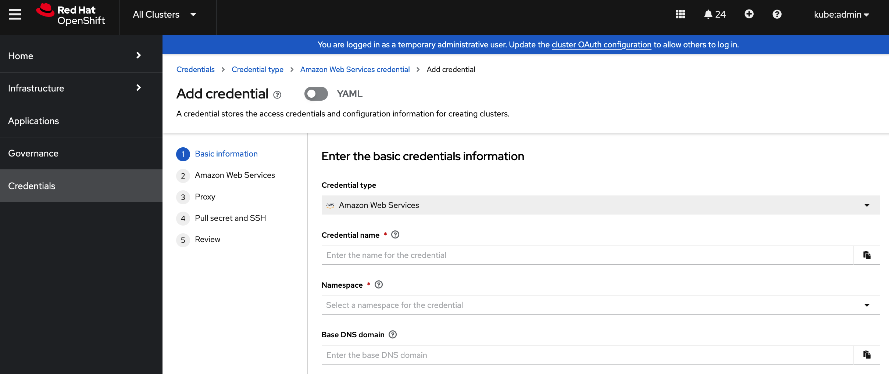

# Credentials For Creating A Hosted Cluster in AWS

When creating a hosted cluster using the `hcp create cluster aws` CLI command, you need to provide your AWS account credentials that have permissions to create infrastructure resources for your cluster such as VPCs, subnets, and NAT gateways, etc. The AWS credentials can be provided in two different ways.

## Using the --aws-creds flag

Use this flag with the value which is the AWS credentials file path.

## Using Cloud Provider Secret for creating a hosted cluster in AWS

You can use a AWS cloud provider secret from MCE. The secret has the following format.

```
apiVersion: v1
metadata:
  name: my-aws-cred
  namespace: clusters      
type: Opaque
kind: Secret
stringData:
  ssh-publickey:          # Value
  ssh-privatekey:         # Value
  pullSecret:             # Value, required
  baseDomain:             # Value, required
  aws_secret_access_key:  # Value, required
  aws_access_key_id:      # Value, required
```

Since the secret contains the SSH keys, pull secret, base domain and AWS credentials, you can use the `hcp create cluster aws` command with the `--secret-creds my-aws-cred` flag where `my-aws-cred` is the cloud provider secret name. If the secret is not in the default `clusters` namespace, you must also specify the namespace as well.  `--secret-creds my-aws-cred --namespace somwhereelse`. By using this secret, the following flags become optional.

- `--aws-creds`
- `--base-domain`
- `--pull-secret`
- `--ssh-key`

If these flags are specified along with the `--secret-creds my-aws-cred` flag, these individual flags take precedence over the values in the cloud provider secret.

To create this secret with the MCE console, follow the credential creation steps by accessing Credentials in the navigation menu: https://<mce-multicluster-console>/multicloud/credentials/create.

  

You can also create the secret in a command line.

```
$ oc create secret generic <my-secret> -n <namespace> --from-literal=baseDomain='your.domain.com' --from-literal=aws_access_key_id='your-aws-access-key' --from-literal=aws_secret_access_key='your-aws-secret-key' --from-literal=pullSecret='{"auths":{"cloud.openshift.com":{"auth":"auth-info", "email":"xx@redhat.com"}, "quay.io":{"auth":"auth-info", "email":"xx@redhat.com"} } }' --from-literal=ssh-publickey='your-ssh-publickey' --from-literal=ssh-privatekey='your-ssh-privatekey'
```