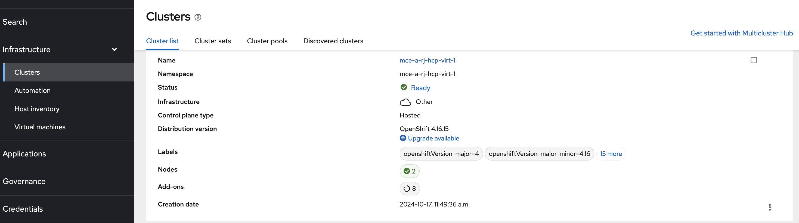
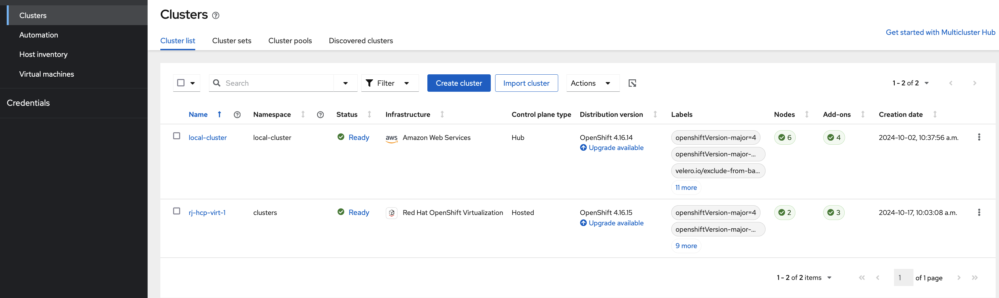
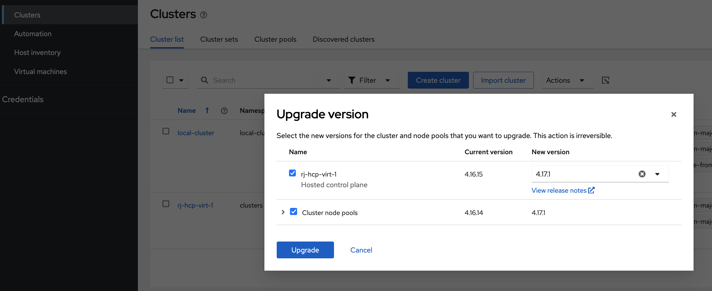
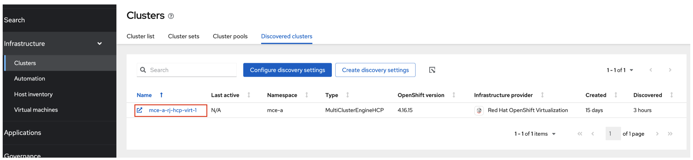

# Discovering and Managing Hosted Clusters with ACM

This guide explains how to integrate MultiCluster Engine (MCE) hosting clusters with Red Hat Advanced Cluster Management (ACM) to automatically discover and manage hosted clusters at scale.

## Overview

When you have MCE clusters hosting multiple hosted clusters, you can import these MCE clusters into an ACM hub to leverage ACM's comprehensive management capabilities, including application management and security policies. This integration enables automatic discovery and import of hosted clusters as managed clusters.

## Architecture

### Supported Topology

The recommended topology consists of:

- **ACM Hub Cluster**: Central management plane
- **MCE Hosting Clusters**: One or more managed clusters running MCE (ACM installation on these clusters is not supported)


In this setup, managed clusters are MCE-enabled clusters that provide additional operators like Hive and BareMetal infrastructure operators, extending your management capabilities beyond vanilla OpenShift Container Platform.

### Scaling Considerations

- **Resource-based scaling**: Hosted control plane capacity depends on the resource availability of MCE cluster nodes
- **Horizontal scaling**: Add more nodes or MCE clusters to increase hosted control plane capacity
- **Performance**: Control planes run directly on MCE cluster nodes, ensuring optimal performance

## Prerequisites

Before beginning the integration process, ensure you have:

- Access to both ACM hub and MCE clusters with cluster-admin privileges
- `oc` CLI tool installed and configured
- `clusteradm` CLI tool installed
- Network connectivity between ACM hub and MCE clusters

## Step 1: Prepare ACM Hub for MCE Integration

### Configure Addon Deployment Namespace

MCE clusters have a self-managed cluster called `local-cluster` with default addons enabled. To avoid conflicts, ACM addons must be installed in a separate namespace.

First, verify the current addon state on your MCE cluster:

```bash
oc get managedclusteraddon -n local-cluster
```

Expected output:
```
NAME                     AVAILABLE   DEGRADED   PROGRESSING
cluster-proxy            True                   False
hypershift-addon         True        False      False
managed-serviceaccount   True                   False
work-manager             True                   False
```

### Create Addon Deployment Configuration

On the ACM hub cluster, create an `AddOnDeploymentConfig` to specify an alternative installation namespace:

```yaml
cat <<EOF | oc apply -f -
apiVersion: addon.open-cluster-management.io/v1alpha1
kind: AddOnDeploymentConfig
metadata:
  name: addon-ns-config
  namespace: multicluster-engine
spec:
  agentInstallNamespace: open-cluster-management-agent-addon-discovery
EOF
```

### Update ClusterManagementAddOn Resources

Update each addon to reference the new deployment configuration:

#### Work Manager Addon

```yaml
cat <<EOF | oc apply -f -
apiVersion: addon.open-cluster-management.io/v1alpha1
kind: ClusterManagementAddOn
metadata:
  name: work-manager
spec:
  addOnMeta:
    displayName: work-manager
  installStrategy:
    placements:
    - name: global
      namespace: open-cluster-management-global-set
      rolloutStrategy:
        type: All
      configs:
      - group: addon.open-cluster-management.io
        name: addon-ns-config
        namespace: multicluster-engine
        resource: addondeploymentconfigs
    type: Placements
EOF
```

#### Managed Service Account Addon

```yaml
cat <<EOF | oc apply -f -
apiVersion: addon.open-cluster-management.io/v1alpha1
kind: ClusterManagementAddOn
metadata:
  name: managed-serviceaccount
spec:
  addOnMeta:
    displayName: managed-serviceaccount
  installStrategy:
    placements:
    - name: global
      namespace: open-cluster-management-global-set
      rolloutStrategy:
        type: All
      configs:
      - group: addon.open-cluster-management.io
        name: addon-ns-config
        namespace: multicluster-engine
        resource: addondeploymentconfigs
    type: Placements
EOF
```

#### Cluster Proxy Addon

```yaml
cat <<EOF | oc apply -f -
apiVersion: addon.open-cluster-management.io/v1alpha1
kind: ClusterManagementAddOn
metadata:
  name: cluster-proxy
spec:
  addOnMeta:
    displayName: cluster-proxy
  installStrategy:
    placements:
    - name: global
      namespace: open-cluster-management-global-set
      rolloutStrategy:
        type: All
      configs:
      - group: addon.open-cluster-management.io
        name: addon-ns-config
        namespace: multicluster-engine
        resource: addondeploymentconfigs
    type: Placements
EOF
```

### Create Klusterlet Configuration

Create a `KlusterletConfig` to ensure ACM's klusterlet installs in a separate namespace from MCE's local-cluster klusterlet:

```yaml
cat <<EOF | oc apply -f -
apiVersion: config.open-cluster-management.io/v1alpha1
kind: KlusterletConfig
metadata:
  name: mce-import-klusterlet-config
spec:
  installMode:
    type: noOperator
    noOperator:
      postfix: mce-import
EOF
```

### Verify Configuration

After applying these changes, verify that addons are installed in the new namespace:

```bash
oc get deployment -n open-cluster-management-agent-addon-discovery
```

Expected output:
```
NAME                                 READY   UP-TO-DATE   AVAILABLE   AGE
cluster-proxy-proxy-agent            1/1     1            1           24h
klusterlet-addon-workmgr             1/1     1            1           24h
managed-serviceaccount-addon-agent   1/1     1            1           24h
```

## Step 2: Import MCE Clusters into ACM

### Create ManagedCluster Resource

Create a `ManagedCluster` resource for each MCE cluster you want to import:

```yaml
cat <<EOF | oc apply -f -
apiVersion: cluster.open-cluster-management.io/v1
kind: ManagedCluster
metadata:
  annotations:
    agent.open-cluster-management.io/klusterlet-config: mce-import-klusterlet-config
  labels:
    cloud: auto-detect
    vendor: auto-detect
  name: mce-a  # Replace with your MCE cluster name
spec:
  hubAcceptsClient: true
  leaseDurationSeconds: 60
EOF
```

**Important**: The annotation `agent.open-cluster-management.io/klusterlet-config: mce-import-klusterlet-config` ensures the klusterlet installs in the correct namespace.

### Complete Auto-Import Process

Follow the [official ACM documentation](https://access.redhat.com/documentation/en-us/red_hat_advanced_cluster_management_for_kubernetes/2.10/html-single/clusters/index#importing-clusters-auto-import-secret) to create the auto-import secret.

After successful import, verify the cluster status:

```bash
oc get managedcluster
```

Expected output:
```
NAME            HUB ACCEPTED   MANAGED CLUSTER URLS                                         JOINED   AVAILABLE   AGE
local-cluster   true           https://api.acm-hub.example.com:6443                        True     True        44h
mce-a           true           https://api.mce-a.example.com:6443                          True     True        27s
```

**⚠️ Important**: Do not enable other ACM addons for imported MCE clusters beyond the required ones.

## Step 3: Enable HyperShift Addon for MCE Clusters

### Configure HyperShift Addon Deployment

Update the HyperShift addon deployment configuration:

```bash
# Set installation namespace
oc patch addondeploymentconfig hypershift-addon-deploy-config \
  -n multicluster-engine \
  --type=merge \
  -p '{"spec":{"agentInstallNamespace":"open-cluster-management-agent-addon-discovery"}}'

# Configure addon variables
oc patch addondeploymentconfig hypershift-addon-deploy-config \
  -n multicluster-engine \
  --type=merge \
  -p '{"spec":{"customizedVariables":[{"name":"disableMetrics","value":"true"},{"name":"disableHOManagement","value":"true"}]}}'
```

### Enable Addon for MCE Clusters

Enable the HyperShift addon for your imported MCE clusters:

```bash
clusteradm addon enable --names hypershift-addon --clusters <MCE_CLUSTER_NAMES>
```

Replace `<MCE_CLUSTER_NAMES>` with comma-separated list of your MCE cluster names. Get the list with:

```bash
oc get managedcluster --no-headers | grep -v local-cluster | awk '{print $1}'
```

### Verify Addon Installation

On each MCE cluster, verify the addon installation:

```bash
oc get deployment -n open-cluster-management-agent-addon-discovery
```

Expected output should include:
```
NAME                                 READY   UP-TO-DATE   AVAILABLE   AGE
hypershift-addon-agent               1/1     1            1           24h
klusterlet-addon-workmgr             1/1     1            1           24h
managed-serviceaccount-addon-agent   1/1     1            1           24h
```

## Step 4: Discover Hosted Clusters

### Understanding Discovery

The HyperShift addon acts as a discovery agent that:

1. Monitors hosted clusters in MCE
2. Creates `DiscoveredCluster` CRs in ACM when hosted cluster APIs become available
3. Enables automatic import into ACM as managed clusters

### View Discovered Clusters

In the ACM hub console:
1. Navigate to **All Clusters** → **Infrastructure** → **Clusters**
2. Click the **Discovered clusters** tab
3. View discovered hosted clusters with type `MultiClusterEngineHCP`


### Configure Naming Convention

By default, imported hosted clusters use the naming pattern: `<mce-cluster-name>-<hosted-cluster-name>`

To customize the naming:

```bash
# Remove prefix (use hosted cluster name only)
oc patch addondeploymentconfig hypershift-addon-deploy-config \
  -n multicluster-engine \
  --type=merge \
  -p '{"spec":{"customizedVariables":[{"name":"disableMetrics","value":"true"},{"name":"disableHOManagement","value":"true"},{"name":"discoveryPrefix","value":""}]}}'

# Use custom prefix
oc patch addondeploymentconfig hypershift-addon-deploy-config \
  -n multicluster-engine \
  --type=merge \
  -p '{"spec":{"customizedVariables":[{"name":"disableMetrics","value":"true"},{"name":"disableHOManagement","value":"true"},{"name":"discoveryPrefix","value":"custom-prefix"}]}}'
```

**Important**: Using an empty string as the custom prefix is not recommended as it can cause klusterlet naming collisions within the MCE cluster. If you need to remove the discovery prefix entirely, ensure all hosted clusters are first detached from their respective MCE clusters.   

## Step 5: Automate Hosted Cluster Import

### Understanding DiscoveredCluster Resources

Discovered hosted clusters are represented as `DiscoveredCluster` CRs:

```yaml
apiVersion: discovery.open-cluster-management.io/v1
kind: DiscoveredCluster
metadata:
  labels:
    hypershift.open-cluster-management.io/hc-name: hosted-cluster-1
    hypershift.open-cluster-management.io/hc-namespace: clusters
  name: hosted-cluster-1
  namespace: mce-1
spec:
  apiUrl: https://example-api-url.com:6443
  cloudProvider: aws
  displayName: mce-1-hosted-cluster-1
  importAsManagedCluster: false  # Set to true to trigger import
  isManagedCluster: false
  name: hosted-cluster-1
  status: Active
  type: MultiClusterEngineHCP
```

### Create Auto-Import Policy

Apply this policy to automatically import discovered hosted clusters:

```yaml
cat <<EOF | oc apply -f -
apiVersion: policy.open-cluster-management.io/v1
kind: Policy
metadata:
  name: policy-mce-hcp-autoimport
  namespace: open-cluster-management-global-set
  annotations:
    policy.open-cluster-management.io/standards: NIST SP 800-53
    policy.open-cluster-management.io/categories: CM Configuration Management
    policy.open-cluster-management.io/controls: CM-2 Baseline Configuration
    policy.open-cluster-management.io/description: |
      Automatically imports discovered MultiClusterEngineHCP clusters into ACM as managed clusters.
      Fine-tune which clusters to import using configMap filters or DiscoveredCluster annotations.
spec:
  disabled: false
  policy-templates:
    - objectDefinition:
        apiVersion: policy.open-cluster-management.io/v1
        kind: ConfigurationPolicy
        metadata:
          name: mce-hcp-autoimport-config
        spec:
          object-templates:
            - complianceType: musthave
              objectDefinition:
                apiVersion: v1
                kind: ConfigMap
                metadata:
                  name: discovery-config
                  namespace: open-cluster-management-global-set
                data:
                  mce-hcp-filter: ""  # Configure filter criteria here
          remediationAction: enforce
          severity: low
    - objectDefinition:
        apiVersion: policy.open-cluster-management.io/v1
        kind: ConfigurationPolicy
        metadata:
          name: policy-mce-hcp-autoimport
        spec:
          remediationAction: enforce
          severity: low
          object-templates-raw: |
            {{- /* Find MultiClusterEngineHCP DiscoveredClusters */ -}}
            {{- range $dc := (lookup "discovery.open-cluster-management.io/v1" "DiscoveredCluster" "" "").items }}
              {{- /* Check if import should be skipped */ -}}
              {{- $skip := "false" -}}
              {{- range $key, $value := $dc.metadata.annotations }}
                {{- if and (eq $key "discovery.open-cluster-management.io/previously-auto-imported")
                           (eq $value "true") }}
                  {{- $skip = "true" }}
                {{- end }}
              {{- end }}
              {{- /* Auto-import eligible clusters */ -}}
              {{- if and (eq $dc.spec.status "Active") 
                         (contains (fromConfigMap "open-cluster-management-global-set" "discovery-config" "mce-hcp-filter") $dc.spec.displayName)
                         (eq $dc.spec.type "MultiClusterEngineHCP")
                         (eq $skip "false") }}
            - complianceType: musthave
              objectDefinition:
                apiVersion: discovery.open-cluster-management.io/v1
                kind: DiscoveredCluster
                metadata:
                  name: {{ $dc.metadata.name }}
                  namespace: {{ $dc.metadata.namespace }}
                spec:
                  importAsManagedCluster: true
              {{- end }}
            {{- end }}
---
apiVersion: cluster.open-cluster-management.io/v1beta1
kind: Placement
metadata:
  name: policy-mce-hcp-autoimport-placement
  namespace: open-cluster-management-global-set
spec:
  tolerations:
    - key: cluster.open-cluster-management.io/unreachable
      operator: Exists
    - key: cluster.open-cluster-management.io/unavailable
      operator: Exists
  clusterSets:
    - global
  predicates:
    - requiredClusterSelector:
        labelSelector:
          matchExpressions:
            - key: local-cluster
              operator: In
              values:
                - "true"
---
apiVersion: policy.open-cluster-management.io/v1
kind: PlacementBinding
metadata:
  name: policy-mce-hcp-autoimport-placement-binding
  namespace: open-cluster-management-global-set
placementRef:
  name: policy-mce-hcp-autoimport-placement
  apiGroup: cluster.open-cluster-management.io
  kind: Placement
subjects:
  - name: policy-mce-hcp-autoimport
    apiGroup: policy.open-cluster-management.io
    kind: Policy
EOF
```

### Verify Auto-Import

After applying the policy, hosted clusters will be automatically imported with all ACM addons enabled. Monitor the process:

```bash
# Check discovered clusters
oc get discoveredcluster --all-namespaces

# Check managed clusters
oc get managedcluster
```



## Lifecycle Management

### Hosted Cluster Management

- **ACM Console**: Use for high-level management, monitoring, and policy enforcement
- **MCE Console**: Use for hosted cluster lifecycle operations (create, update, delete)

**Important**: Hosted cluster lifecycle management (create, scale, delete) must be performed through the MCE console, not ACM.




### Detaching Hosted Clusters

To detach a hosted cluster from ACM:

1. **Via ACM Console**: Use the detach option in the cluster list
2. **Via CLI**: Delete the corresponding `ManagedCluster` CR

```bash
oc delete managedcluster <hosted-cluster-name>
```

**Best Practice**: Always detach managed hosted clusters before destroying them in MCE.

When detached, the system adds an annotation to prevent re-import:

```yaml
metadata:
  annotations:
    discovery.open-cluster-management.io/previously-auto-imported: "true"
```

To enable re-import, remove this annotation:

```bash
oc annotate discoveredcluster <cluster-name> \
  -n <namespace> \
  discovery.open-cluster-management.io/previously-auto-imported-
```

## Backup and Disaster Recovery

### Required Backup Labels

For disaster recovery scenarios, label critical resources for backup:

```bash
# Configuration resources
oc label addondeploymentconfig addon-ns-config \
  -n multicluster-engine \
  cluster.open-cluster-management.io/backup=true

oc label addondeploymentconfig hypershift-addon-deploy-config \
  -n multicluster-engine \
  cluster.open-cluster-management.io/backup=true

# Addon resources
oc label clustermanagementaddon work-manager \
  cluster.open-cluster-management.io/backup=true

oc label clustermanagementaddon cluster-proxy \
  cluster.open-cluster-management.io/backup=true

oc label clustermanagementaddon managed-serviceaccount \
  cluster.open-cluster-management.io/backup=true

# Klusterlet configuration
oc label klusterletconfig mce-import-klusterlet-config \
  cluster.open-cluster-management.io/backup=true
```

### Recovery Process

During ACM hub restoration:
1. Restore all labeled configuration resources
2. MCE clusters and hosted clusters will automatically reconnect
3. Hosted cluster discovery will resume automatically

## Known Limitations

### UI Limitations

1. **Discovered Cluster Links**: Console links for `MultiClusterEngineHCP` type discovered clusters do not open the cluster console

   

2. **Import Action**: Do not use the "Import cluster" action menu for `MultiClusterEngineHCP` discovered clusters - use only the auto-import policy

3. **Last Active Column**: Always shows "N/A" for `MultiClusterEngineHCP` type discovered clusters

### Functional Limitations

1. **Lifecycle Management**: Hosted cluster creation, scaling, and deletion must be performed through MCE console only
2. **Addon Restrictions**: Only enable required ACM addons for imported MCE clusters
3. **Namespace Isolation**: Addon namespace separation is required to prevent conflicts

## Troubleshooting

### Common Issues

1. **Addon Installation Failures**: Verify namespace configurations and klusterlet config references
2. **Discovery Not Working**: Check HyperShift addon deployment and network connectivity
3. **Import Failures**: Verify auto-import policy syntax and ConfigMap filters
4. **Naming Conflicts**: Review and adjust discovery prefix configuration

### Verification Commands

```bash
# Check addon status
oc get managedclusteraddon --all-namespaces

# Verify discovery agent
oc get deployment hypershift-addon-agent -n open-cluster-management-agent-addon-discovery

# Check discovered clusters
oc get discoveredcluster --all-namespaces

# Monitor policy compliance
oc get policy -n open-cluster-management-global-set
```

## Best Practices

1. **Plan Namespace Strategy**: Configure separate namespaces before importing MCE clusters
2. **Implement Gradual Rollout**: Import and configure one MCE cluster before scaling to multiple
3. **Monitor Resource Usage**: Track resource consumption on both ACM hub and MCE clusters
4. **Document Naming Conventions**: Maintain clear naming standards for discovered clusters

This integration provides a powerful foundation for managing large-scale hosted cluster deployments while maintaining the flexibility and capabilities of both ACM and MCE platforms.