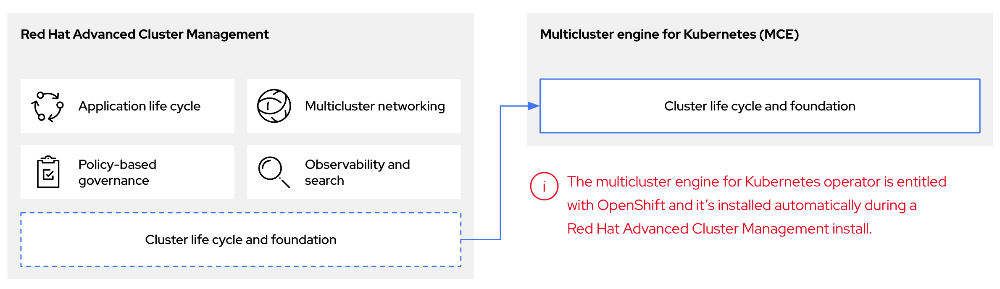
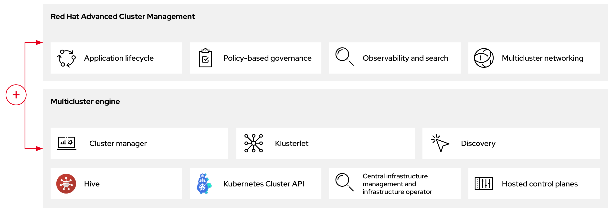

# Introduction

Red Hat Advanced Cluster Management cluster lifecycle defines the process of creating, importing, managing, and destroying Kubernetes clusters across various infrastructure cloud providers, private clouds, and on-premises data centers. The multicluster engine operator is the cluster lifecycle operator that provides cluster management capabilities for OpenShift Container Platform and Red Hat Advanced Cluster Management hub clusters. The multicluster engine operator is a software operator that enhances cluster fleet management and supports OpenShift Container Platform cluster lifecycle management across clouds and data centers. You can use multicluster engine operator with or without Red Hat Advanced Cluster Management. Red Hat Advanced Cluster Management also installs multicluster engine operator automatically and offers further multicluster capabilities. 

With multicluster engine operator cluster management, you can deploy OpenShift Container Platform clusters by using two different control plane configurations: standalone or hosted control planes. The standalone configuration uses dedicated virtual machines or physical machines to host the OpenShift Container Platform control plane. With hosted control planes for OpenShift Container Platform, you create control planes as pods on a hosting cluster without the need for dedicated physical machines for each control plane.

