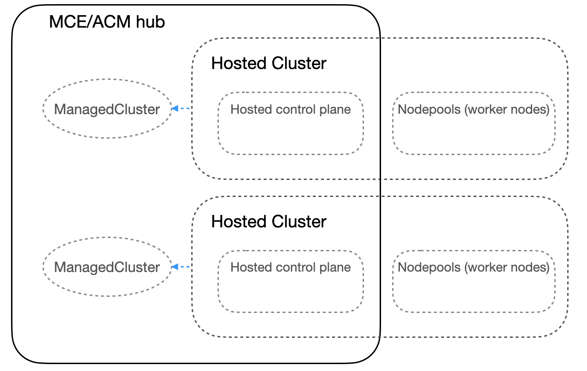
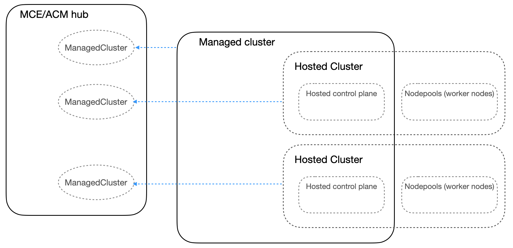

# Hosting Cluster Topologies

This document describes various ways to deploy hosted clusters on a single or multiple OCP clusters and manage them via a MCE or ACM hub cluster. MCE, which is an operator that ACM requires, contains the Hypershift hosted control planes feature. So in this document, MCE hub cluster also means ACM hub cluster.

## MCE hub cluster as a hosting cluster

This is the default hosting cluster topology where MCE hub cluster is the only hosting cluster for all hosted control planes. 




When MCE is installed and MultiClusterEngine instance is created, it auto-enables the following components.

```
% oc get MultiClusterEngine multiclusterengine-sample -o yaml
```

```yaml
  spec:
    availabilityConfig: High
    overrides:
      components:
      - enabled: true
        name: assisted-service
      - enabled: true
        name: cluster-lifecycle
      - enabled: true
        name: cluster-manager
      - enabled: true
        name: discovery
      - enabled: true
        name: hive
      - enabled: true
        name: server-foundation
      - enabled: true
        name: cluster-proxy-addon
      - enabled: true
        name: local-cluster
      - enabled: true
        name: hypershift-local-hosting
      - enabled: true
        name: hypershift
      - enabled: false
        name: managedserviceaccount
      - enabled: true
        name: console-mce
    targetNamespace: multicluster-engine
```

`local-cluster` component creates managed cluster called `local-cluster`.

```
% oc get managedcluster
NAME            HUB ACCEPTED   MANAGED CLUSTER URLS                                                      JOINED   AVAILABLE   AGE
local-cluster   true           https://api.app-aws-east2-414-hub-dvhv7.dev11.red-chesterfield.com:6443   True     True        41h
```

`hypershift` enables the Hypershift hosted control plane feature. This enables the hypershift-addon ManagedClusterAddon manager responsible for enabling the addon for managed clusters. This also enables the [hcp CLI download](https://github.com/stolostron/hypershift-addon-operator/blob/main/docs/installing_hypershift_cli.md).

```
% oc get pod -n multicluster-engine                                                                   
NAME                                                   READY   STATUS    RESTARTS      AGE
hcp-cli-download-6f9c8c946f-jzx5r                      1/1     Running   0             41h
hypershift-addon-manager-5966cc5974-5mmdq              1/1     Running   0             41h
```

`hypershift-local-hosting` enables the hypershift-addon ManagedClusterAddon for `local-cluster` managed cluster. When the hypershift-addon agent gets deployed in `local-cluster` managed cluster, it installs the hypershift operator in `hypershift` namespace. Now, the MCE hub cluster, technically `local-cluster` managed cluster becomes a hosting cluster where users can create hosted control planes.

```
% oc get managedclusteraddon -n local-cluster
NAME               AVAILABLE   DEGRADED   PROGRESSING                 
hypershift-addon   True        False      

% oc get deployment -n hypershift
NAME       READY   UP-TO-DATE   AVAILABLE   AGE
operator   2/2     2            2           41h
```

Now you can download the [hcp CLI](https://github.com/stolostron/hypershift-addon-operator/blob/main/docs/installing_hypershift_cli.md) and use it to create hosted clusters in the MCE hub cluster. The hypershift-addon agent automatically imports the hosted clusters into MCE. You can [disable this auto-import feature](https://github.com/stolostron/hypershift-addon-operator/blob/main/docs/provision_hosted_cluster_on_mce_local_cluster.md#disabling-automatic-import).

While connected to the MCE hub cluster, run `hcp create cluster` CLI command to create a hosted cluster. For example with AWS cloud platform,

```
% hcp create cluster aws --name local-cluster-hcp-1 --pull-secret pull-secret.txt --ssh-key id_rsa.pub --node-pool-replicas 2 --base-domain dev.mydomain.com --aws-creds credentials --region us-west-1
```

This creates a hosted cluster in the MCE hub cluster.

```
% oc get hostedcluster -A
NAMESPACE   NAME                  VERSION       KUBECONFIG                             PROGRESS    AVAILABLE   PROGRESSING   MESSAGE
clusters    local-cluster-hcp-1   4.15.0-rc.2   local-cluster-hcp-1-admin-kubeconfig   Completed   True        False         The hosted control plane is available
```

The hypershift-addon agent for `local-cluster` managed cluster auto-imports this hosted cluster with the same cluster name. If the auto-import feature is disabled, you can manually import the hosted cluster later.

```
% oc get managedcluster
NAME                    HUB ACCEPTED   MANAGED CLUSTER URLS                                                                         JOINED   AVAILABLE   AGE
local-cluster           true           https://api.app-aws-east2-414-hub-dvhv7.dev11.red-chesterfield.com:6443                      True     True        42h
local-cluster-hcp-1     true           https://a80d68b28cf0d4314aef0b193fd75587-d5472a1474a5edb0.elb.us-east-2.amazonaws.com:6443   True     True        14m
```

To delete the hosted cluster, detach the managed cluster first by running `oc delete managedcluster local-cluster-hcp-1` and then `hcp destroy cluster`.

### Scaling option

Since all hosted control planes will be running on the hub cluster's nodes, the number of hosted control planes the cluster can host is determined by the resource availability of the nodes. You can add more nodes to host more hosted control planes.


## MCE managed (AKA spoke, leaf) OCP cluster as a hosting cluster

Clusters in this scenario:

- MCE cluster
- OCP cluster that is imported into MCE as a managed cluster



This is a topology where your MCE hub cluster has one or more remote managed OCP clusters and you want to have hosted control planes in those clusters instead of or on top of having hosted control planes in the hub cluster. Unlike how the `hypershift-addon` managed cluster addon is automatically enabled for `local-cluster` in the default topology described above, this topology requires you to enable the `hypershift-addon` managed cluster addon manually for the remote managed cluster.

In this example, you have a remote managed OCP cluster called `managed-ocp-cluster-1` and you want to create a hosted cluster in that cluster and import it into MCE as a managed cluster. 

```
% oc get managedcluster
NAME                    HUB ACCEPTED   MANAGED CLUSTER URLS                                                      JOINED   AVAILABLE   AGE
local-cluster           true           https://api.app-aws-east2-414-hub-dvhv7.dev11.red-chesterfield.com:6443   True     True        42h
managed-ocp-cluster-1   true           https://api.app-aws-east2-414-hub-lmwbw.dev11.red-chesterfield.com:6443   True     True        26m
```

Enable the `hypershift-addon` managed cluster addon for `managed-ocp-cluster-1` managed cluster so that the addon agent installs the hypershift operator in `managed-ocp-cluster-1` to make it a hosting cluster. There are a couple of ways to enable the addon.

### Scaling option

Since the hosted control planes run on the managed OCP clusters' nodes, the number of hosted control planes the cluster can host is determined by the resource availability of managed OCP clusters' nodes as well as the number of managed OCP clusters. You can add more nodes or managed clusters to host more hosted control planes.

### Enable the addon by using clusteradm CLI

Before enabling the hypershift-addon, configure the addon deployment to disable the hosted cluster discovery by setting spec.disableHCDiscovery to true in `hypershift-addon-deploy-config` addondeploymentconfig.
```
oc edit addondeploymentconfig hypershift-addon-deploy-config -n multicluster-engine
```
```yaml
spec:
  agentInstallNamespace: open-cluster-management-agent-addon
  customizedVariables:
  - name: hcMaxNumber
    value: "80"
  - name: hcThresholdNumber
    value: "60"
  - name: disableHCDiscovery
    value: "true"
  nodePlacement:
    tolerations:
    - effect: NoSchedule
      key: node-role.kubernetes.io/infra
      operator: ExistsAdd commentMore actions
```

[Install the clusteradmin CLI](https://open-cluster-management.io/getting-started/quick-start/#install-clusteradm-cli-tool) and run the following command to enable the `hypershift-addon` for `managed-ocp-cluster-1` managed cluster.

```
% clusteradm addon enable --names hypershift-addon --clusters managed-ocp-cluster-1
Deploying hypershift-addon add-on to namespaces open-cluster-management-agent-addon of managed cluster: managed-ocp-cluster-1.

% oc get managedclusteraddon -n managed-ocp-cluster-1 
NAME               AVAILABLE   DEGRADED   PROGRESSING                  
hypershift-addon   True        False       
```

### Enable the addon by using ManagedClusterAddon

You can enable the `hypershift-addon` for `managed-ocp-cluster-1` managed cluster by creating the following `ManagedClusterAddon` resource in the hub cluster.

```yaml
apiVersion: addon.open-cluster-management.io/v1alpha1
kind: ManagedClusterAddOn
metadata:
  name: hypershift-addon
  namespace: managed-ocp-cluster-1
spec:
  installNamespace: open-cluster-management-agent-addon
```

```
% oc get managedclusteraddon -n managed-ocp-cluster-1 
NAME               AVAILABLE   DEGRADED   PROGRESSING                 
hypershift-addon   True        False      
```

Once the `hypershift-addon` is enabled, you can log into the managed cluster and check that the hypershift-addon agent is deployed and the hypershift operator is installed in `hypershift` namespace.

```
% oc get deployment -n open-cluster-management-agent-addon
NAME                        READY   UP-TO-DATE   AVAILABLE   AGE
hypershift-addon-agent      1/1     1            1           2m25s

% oc get deployment -n hypershift
NAME       READY   UP-TO-DATE   AVAILABLE   AGE
operator   2/2     2            2           3m14s
```

### Configuring the hypershift operator

If you want to [configure the hypershift operator](https://github.com/stolostron/hypershift-addon-operator/blob/main/docs/hypershift_operator_configuration.md) or [configure the hypershift operator with AWS](https://github.com/stolostron/hypershift-addon-operator/blob/main/docs/provision_hosted_cluster_on_mce_local_cluster.md#prerequisites-for-creating-hosted-clusters-on-aws-cloud-platform), you can follow the configuration documentation but replace `local-cluster` with `managed-ocp-cluster-1` managed cluster. These configuration secrets need to be created in `managed-ocp-cluster-1` managed cluster in the hub cluster. The hypershift-addon agent will automatically reconcile the hypershift operator in the managed cluster.

For example, I want to configure the hypershift operator in `managed-ocp-cluster-1` cluster with my AWS OIDC S3 secret.

```
% oc create secret generic hypershift-operator-oidc-provider-s3-credentials --from-file=credentials=/.aws/credentials --from-literal=bucket=my-s3-bucket --from-literal=region=us-west-1 -n managed-ocp-cluster-1
```

### Creating a hosted cluster

You cannot create a hosted cluster from the MCE hub cluster. Connect to the remote managed cluster and run `hcp create cluster` CLI command to create the hosted cluster. For example with AWS cloud platform,

```
% hcp create cluster aws --name managed-ocp-cluster-hcp-1 --pull-secret pull-secret.txt --ssh-key id_rsa.pub --node-pool-replicas 2 --base-domain dev.mydomain.com --aws-creds credentials --region us-west-1
```

```
% oc get hostedcluster -A
NAMESPACE   NAME                        VERSION       KUBECONFIG                             PROGRESS    AVAILABLE   PROGRESSING   MESSAGE
clusters    managed-ocp-cluster-hcp-1   4.15.0-rc.2   local-cluster-hcp-1-admin-kubeconfig   Completed   True        False         The hosted control plane is available
```

**Note:** Ths hosted cluster in a remote managed cluster is not automatically imported into MCE.

### Importing the hosted cluster

The hosted cluster in `managed-ocp-cluster-1` remote managed cluster is not automatically imported into the MCE hub in this topology. You can manually import the hosted cluster just like how you manually import any other cluster or you can create the following `ManagedCluster` resource in the MCE hub cluster to get the hosted cluster auto-imported.

```yaml
apiVersion: cluster.open-cluster-management.io/v1
kind: ManagedCluster
metadata:  
  annotations:    
    import.open-cluster-management.io/hosting-cluster-name: managed-ocp-cluster-1    
    import.open-cluster-management.io/klusterlet-deploy-mode: Hosted
    open-cluster-management/created-via: hypershift  
  name: managed-ocp-cluster-hcp-1
spec:  
  hubAcceptsClient: true  
```

The annotations and the name are important. `import.open-cluster-management.io/hosting-cluster-name: managed-ocp-cluster-1` annotation must have the managed cluster name `managed-ocp-cluster-1` where the hosted cluster is hosted and `import.open-cluster-management.io/klusterlet-deploy-mode: Hosted` is required. The name must match the hosted cluster name. For example, if you created the hosted cluster using `hcp create cluster aws --name managed-ocp-cluster-hcp-1`, then this ManagedCluster name must be `managed-ocp-cluster-hcp-1`. Once this ManagedCluster is created, the hosted cluster gets imported into MCE.

```
% oc get managedcluster
NAME                        HUB ACCEPTED   MANAGED CLUSTER URLS                                                                         JOINED   AVAILABLE   AGE
local-cluster               true           https://api.app-aws-east2-414-hub-dvhv7.dev11.red-chesterfield.com:6443                      True     True        44h
managed-ocp-cluster-1       true           https://api.app-aws-east2-414-hub-lmwbw.dev11.red-chesterfield.com:6443                      True     True        176m
managed-ocp-cluster-hcp-1   true           https://a16a76a9a15434831a712fe7e981ac6c-5c05df023b0cef13.elb.us-east-2.amazonaws.com:6443   True     True        9m
```

Once hosted cluster `managed-ocp-cluster-hcp-1` creation is completed in `managed-ocp-cluster-1` remote managed hosting cluster, the hosted cluster is imported to become a managed cluster. You can use all the ACM management features on this cluster but you cannot manage the lifecycle of the cluster itself (upgrade, scaling, etc) from the MCE hub cluster. You need to connect to `managed-ocp-cluster-1` remote managed hosting cluster and manage the lifecycle through `HostedCluster` or `NodePool` resources directly.

## MCE as a hosting cluster managed by ACM

**Note:** This section is replaced by [discovering hosted clusters](https://github.com/stolostron/hypershift-addon-operator/blob/main/docs/discovering_hostedclusters.md).

Clusters in this topology:

- ACM or MCE cluster as a hub cluster
- One ore more MCE clusters as managed clusters

In the previous topology, the managed clusters are vanilla OCP clusters and we turned them into hosting clusters by enabling the hypershift addon. In this topology, the managed clusters are MCE clusters. One of the reasons why you want managed clusters to be MCE clusters instead of vanilla OCP is that MCE installs other operators like hive and BareMetal infrastructure operators that you can take advantage of.

### Scaling option

Since the hosted control planes run on the managed MCE clusters' nodes, the number of hosted control planes the cluster can host is determined by the resource availability of managed MCE clusters' nodes as well as the number of managed MCE clusters. You can add more nodes or managed clusters to host more hosted control planes.

### Importing an MCE cluster into ACM

In order to import an MCE cluster, you need to disable the self management feature in MCE. Edit the MCE instance and disable `hypershift-local-hosting` component. This disables the hypershift addon for `local-cluster` and uninstalls the hypershift operator.


```
% oc patch mce $(oc get mce --no-headers -o custom-columns=":metadata.name") --type=merge -p '{"spec":{"overrides":{"components":[{"name":"hypershift-local-hosting","enabled": false}]}}}'
```

Check that the `hypershift-addon` is removed from `local-cluster`.

```
% oc get managedclusteraddon -A
NAMESPACE       NAME                     AVAILABLE   DEGRADED   PROGRESSING
local-cluster   cluster-proxy            True
local-cluster   managed-serviceaccount   True                   False
local-cluster   work-manager             True
```

If the MCE cluster must have only the `local-cluster` managed cluster. If you have any other managed cluster, they need to be detached before continuing.

```
% oc get managedcluster
NAME            HUB ACCEPTED   MANAGED CLUSTER URLS                                                      JOINED   AVAILABLE   AGE
local-cluster   true           https://api.app-aws-east2-414-hub-mhmkb.dev11.red-chesterfield.com:6443   True     True        155m
```

Now, disable the self managed feature by disabling `local-cluster` component in MCE.

```
% oc patch mce $(oc get mce --no-headers -o custom-columns=":metadata.name") --type=merge -p '{"spec":{"overrides":{"components":[{"name":"local-cluster","enabled": false}]}}}'
```

Check that there is no managed cluster.

```
% oc get managedcluster
No resources found
```

The MCE cluster is now ready to be imported into an ACM or MCE hub cluster. Follow this [documentation on importing a cluster.](https://access.redhat.com/documentation/en-us/red_hat_advanced_cluster_management_for_kubernetes/2.9/html-single/clusters/index#import-intro).

### Enable the addon by using ManagedClusterAddon

Log into the ACM hub cluster and you should be able to see the MCE cluster as a managed cluster. Let's assume that the managed cluster name for the imported MCE cluster is `managed-mce-1`.

```
% oc get managedcluster
NAME            HUB ACCEPTED   MANAGED CLUSTER URLS                                                      JOINED   AVAILABLE   AGE
local-cluster   true           https://api.app-aws-east2-414-hub-2pqrq.dev11.red-chesterfield.com:6443   True     True        3h12m
managed-mce-1   true           https://api.app-aws-east2-414-hub-mhmkb.dev11.red-chesterfield.com:6443   True     True        11m
```

Enable the `hypershift-addon` for `managed-mce-1` managed cluster by creating the following `ManagedClusterAddon` resource in the ACM hub cluster. Doing this installs the hypershift addon agent and the hypershift operator in the MCE cluster.


```bash
% cat <<EOF | oc apply -f -
apiVersion: addon.open-cluster-management.io/v1alpha1
kind: ManagedClusterAddOn
metadata:
  name: hypershift-addon
  namespace: managed-mce-1
spec:
  installNamespace: open-cluster-management-agent-addon
EOF
```

Check that the `hypershift-addon` is enabled (AVAILABLE=True) and working (DEGRADED=False).

```
% oc get managedclusteraddon -n managed-mce-1
NAME                          AVAILABLE   DEGRADED   PROGRESSING
application-manager           True
cert-policy-controller        True
cluster-proxy                 True
config-policy-controller      True
governance-policy-framework   True
hypershift-addon              True        False
iam-policy-controller         True
managed-serviceaccount        True                   False
search-collector              True
work-manager                  True   
```

Also you can log into the MCE cluster and check that the hypershift-addon agent is deployed and the hypershift operator is installed in `hypershift` namespace.

```
% oc get deployment -n open-cluster-management-agent-addon
NAME                        READY   UP-TO-DATE   AVAILABLE   AGE
hypershift-addon-agent      1/1     1            1           2m25s

% oc get deployment -n hypershift
NAME       READY   UP-TO-DATE   AVAILABLE   AGE
operator   2/2     2            2           3m14s
```

### Optionally configuring the hypershift operator for AWS

If you want to [configure the hypershift operator](https://github.com/stolostron/hypershift-addon-operator/blob/main/docs/hypershift_operator_configuration.md) or [configure the hypershift operator with AWS](https://github.com/stolostron/hypershift-addon-operator/blob/main/docs/provision_hosted_cluster_on_mce_local_cluster.md#prerequisites-for-creating-hosted-clusters-on-aws-cloud-platform), you can follow the configuration documentation but replace `local-cluster` with `managed-mce-1` managed cluster. These configuration secrets need to be created in `managed-mce-1` managed cluster in the hub cluster. The hypershift-addon agent will automatically reconcile the hypershift operator in the managed cluster.

For example, I want to configure the hypershift operator in `managed-mce-1` cluster with my AWS OIDC S3 secret.

```
% oc create secret generic hypershift-operator-oidc-provider-s3-credentials --from-file=credentials=/.aws/credentials --from-literal=bucket=my-s3-bucket --from-literal=region=us-west-1 -n managed-mce-1
```

### Creating a hosted cluster

You cannot create a hosted cluster from the ACM hub cluster. Connect to the MCE cluster and run `hcp create cluster` CLI command to create the hosted cluster. For example with AWS cloud platform,

```
% hcp create cluster aws --name managed-mce-hcp-1 --pull-secret pull-secret.txt --ssh-key id_rsa.pub --node-pool-replicas 2 --base-domain dev.mydomain.com --aws-creds credentials --region us-west-1
```

```
% oc get hostedcluster -A
NAMESPACE   NAME                        VERSION       KUBECONFIG                             PROGRESS    AVAILABLE   PROGRESSING   MESSAGE
clusters    managed-mce-hcp-1           4.15.0-rc.2   local-cluster-hcp-1-admin-kubeconfig   Completed   True        False         The hosted control plane is available
```

**Note:** Ths hosted cluster in a remote MCE managed cluster is not automatically imported into ACM.

### Importing the hosted cluster into ACM

The hosted cluster in the MCE cluster is not automatically imported into the MCE hub in this topology. You can manually import the hosted cluster just like how you manually import any other cluster or you can create the following `ManagedCluster` resource in the ACM hub cluster to get the hosted cluster auto-imported.

Run the following commands in the ACM cluster to import the hosted cluster `managed-mce-hcp-1` and enable ACM addons.

```bash
% cat <<EOF | oc apply -f -
apiVersion: cluster.open-cluster-management.io/v1
kind: ManagedCluster
metadata:  
  annotations:    
    import.open-cluster-management.io/hosting-cluster-name: managed-mce-1    
    import.open-cluster-management.io/klusterlet-deploy-mode: Hosted
    open-cluster-management/created-via: hypershift  
  name: managed-mce-hcp-1
spec:  
  hubAcceptsClient: true
EOF
```

The annotations and the name are important. `import.open-cluster-management.io/hosting-cluster-name: managed-mce-1` annotation must have the managed cluster name `managed-mce-1` where the hosted cluster is hosted and `import.open-cluster-management.io/klusterlet-deploy-mode: Hosted` is required. The name must match the hosted cluster name. For example, if you created the hosted cluster using `hcp create cluster aws --name managed-mce-hcp-1`, then this ManagedCluster name must be `managed-mce-hcp-1`. Once this ManagedCluster is created, the hosted cluster gets imported into MCE.

```bash
$ cat <<EOF | oc apply -f -
apiVersion: agent.open-cluster-management.io/v1
kind: KlusterletAddonConfig
metadata:
  name: managed-mce-hcp-1
  namespace: managed-mce-hcp-1
spec:
  clusterName: managed-mce-hcp-1
  clusterNamespace: managed-mce-hcp-1
  clusterLabels:
    cloud: auto-detect
    vendor: auto-detect
  applicationManager:
    enabled: true
  certPolicyController:
    enabled: true
  iamPolicyController:
    enabled: true
  policyController:
    enabled: true
  searchCollector:
    enabled: false
EOF
```

You can see that the hosted cluster `managed-mce-hcp-1` is now imported into ACM along with the MCE cluster `managed-mce-1` and ACM addons are enabled.

```
% oc get managedcluster
NAME                HUB ACCEPTED   MANAGED CLUSTER URLS                                                                         JOINED   AVAILABLE   AGE
local-cluster       true           https://api.app-aws-east2-414-hub-2pqrq.dev11.red-chesterfield.com:6443                      True     True        4h27m
managed-mce-1       true           https://api.app-aws-east2-414-hub-mhmkb.dev11.red-chesterfield.com:6443                      True     True        85m
managed-mce-hcp-1   true           https://a6b99565aac5747f4918144af59638d5-d21907a61cad03d2.elb.us-east-2.amazonaws.com:6443   True     True        2m19s
```

```
% oc get managedclusteraddon -n managed-mce-hcp-1
NAME                          AVAILABLE   DEGRADED   PROGRESSING
application-manager           True
cert-policy-controller        True
cluster-proxy                 True
config-policy-controller      True
governance-policy-framework   True
iam-policy-controller         True
managed-serviceaccount        True                   False
work-manager                  True
```
