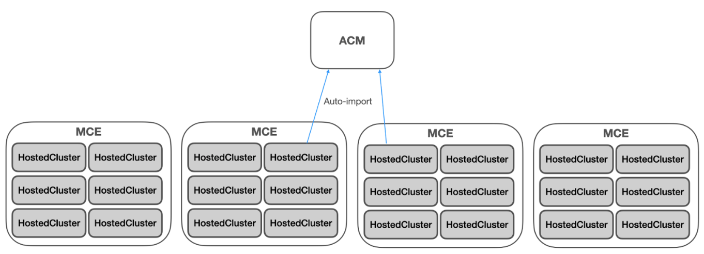
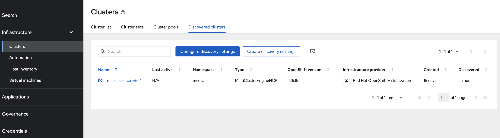

# Discovering and Managing Hosted Clusters with ACM

This guide explains how to integrate MultiCluster Engine (MCE) hosting clusters with Red Hat Advanced Cluster Management (ACM) to automatically discover and manage hosted clusters at scale.

## Quick Start

For experienced users who want to get started immediately:

1. **Configure ACM Hub**: Update HyperShift addon deployment config with `configureMceImport: "true"`
2. **Import MCE Clusters**: Create `ManagedCluster` resources with proper annotations
3. **Enable HyperShift Addon**: Run `clusteradm addon enable --names hypershift-addon --clusters <MCE_CLUSTERS>`
4. **Configure Auto-Import**: Apply the auto-import policy to automatically discover hosted clusters
5. **Verify**: Check that hosted clusters appear as `DiscoveredCluster` resources and get imported as managed clusters

**Estimated Time**: 60-90 minutes for complete setup

For detailed step-by-step instructions, continue reading below.

## Overview

When you have MCE clusters hosting multiple hosted clusters, you can import these MCE clusters into an ACM hub to leverage ACM's comprehensive management capabilities, including application management and security policies. This integration enables automatic discovery and import of hosted clusters as managed clusters.

## Architecture

### Supported Topology

The recommended topology for hosted control planes consists of three main architectural components:

### ACM Hub Cluster
The **ACM Hub Cluster** serves as the central management plane and provides:

- **Comprehensive Management Capabilities**:
  - Application lifecycle management
  - Security policy enforcement and compliance
  - High-level monitoring and observability
  - Centralized governance across all managed clusters

- **Hosted Cluster Discovery and Management**:
  - Automatically discovers hosted clusters from MCE hosting clusters
  - Creates `DiscoveredCluster` CRs when hosted cluster API servers become available
  - Enables auto-import of discovered hosted clusters as managed clusters
  - Provides centralized visibility and policy enforcement across all hosted clusters

- **Disaster Recovery Coordination**:
  - Orchestrates backup and restore operations
  - Manages OADP resources in the `open-cluster-management-backup` namespace
  - Coordinates hosted cluster recovery processes

### MCE Hosting Clusters
**MCE Hosting Clusters** are one or more managed clusters that:

- **Run MultiCluster Engine (MCE)** infrastructure components
- **Host multiple hosted control planes** for workload clusters
- **Integrate with ACM** while maintaining operational independence

**Key Characteristics**:
- **Restriction**: ACM installation on MCE clusters is not supported
- **Management**: Imported into the ACM hub as managed clusters
- **Enhanced Capabilities**: Provide additional operators including:
  - Hive operator for cluster provisioning
  - BareMetal infrastructure operators
  - HyperShift operator for hosted control planes

### Hosted Clusters

**Hosted Clusters** are the actual workload clusters whose control planes run on MCE hosting clusters:

- **Control Plane Location**: Hosted control planes run as pods on MCE cluster nodes
- **Worker Nodes**: Can be located external to the MCE hosting cluster
- **Separate Disaster Recovery**: Have their own backup and restore processes independent of ACM




### Scaling Considerations

- **Resource-based scaling**: Hosted control plane capacity depends on the resource availability of MCE cluster nodes
- **Horizontal scaling**: Add more nodes or MCE clusters to increase hosted control plane capacity
- **Performance**: Control planes run directly on MCE cluster nodes, ensuring optimal performance

## Prerequisites

Before beginning the integration process, ensure you have:

### Software Requirements

- **Red Hat Advanced Cluster Management (ACM)**: Version 2.15 or later
- **MultiCluster Engine (MCE)**: Version 2.10 or later
- **HyperShift**: Compatible version installed on MCE clusters

### Access and Tools

- Access to both ACM hub and MCE clusters with cluster-admin privileges
- `oc` CLI tool installed and configured (version 4.14+)
- `clusteradm` CLI tool installed (latest version recommended)
- Network connectivity between ACM hub and MCE clusters

## Step 1: Prepare ACM Hub for MCE Integration

### Configure ACM to import MCE clusters

MCE clusters have a self-managed cluster called `local-cluster` with default addons enabled. To avoid conflicts, ACM addons must be installed in a separate namespace.

In the ACM hub cluster, update the HyperShift addon deployment configuration to configure ACM addons so that they get installed in `open-cluster-management-agent-addon-discovery` namespace. 

```bash
oc patch addondeploymentconfig hypershift-addon-deploy-config -n multicluster-engine --type=merge -p '{"spec":{"customizedVariables":[{"name":"configureMceImport","value":"true"}]}}'
```

#### Understanding configureMceImport

The `configureMceImport` variable controls how ACM addons are deployed when importing MCE clusters:

- **`configureMceImport: "true"`** (Required for MCE integration):
  - ACM addons install in the `open-cluster-management-agent-addon-discovery` namespace
  - Prevents conflicts with MCE's self-managed `local-cluster` addons
  - Enables proper isolation between ACM management and MCE operations

- **`configureMceImport: "false"` or unset** (Default behavior):
  - ACM addons install in the standard `open-cluster-management-agent-addon` namespace
  - Suitable for regular managed clusters that are not MCE hosting clusters
  - Will cause conflicts if used with MCE clusters due to namespace collisions

#### ⚠️ Changing configureMceImport from true to false

If you need to change `configureMceImport` from `true` to `false` (e.g., converting an MCE cluster to a regular managed cluster), follow this checklist:

**Pre-Change Steps:**
- [ ] Detach all discovered hosted clusters from ACM management
- [ ] Disable HyperShift addon for the target cluster: `clusteradm addon disable --names hypershift-addon --clusters <cluster-name>`

**Configuration Change:**
- [ ] Update the configuration: `oc patch addondeploymentconfig hypershift-addon-deploy-config -n multicluster-engine --type=merge -p '{"spec":{"customizedVariables":[{"name":"configureMceImport","value":"false"}]}}'`
- [ ] Wait for the configuration to propagate (5-10 minutes)

**Post-Change Steps:**
- [ ] Clean up resources in `open-cluster-management-agent-addon-discovery` namespace on the target cluster
- [ ] Verify addons are now installing in `open-cluster-management-agent-addon` namespace
- [ ] Re-enable required addons for regular managed cluster operation
- [ ] Test cluster management functionality through ACM console

**Verification:**
- [ ] Confirm no resource conflicts in addon namespaces
- [ ] Verify cluster appears healthy in ACM console
- [ ] Test policy and application deployment to the cluster
- [ ] Ensure no error messages in klusterlet logs

**⚠️ Warning:** This change is disruptive and should only be performed during maintenance windows. The cluster will temporarily lose ACM management capabilities during the transition.

### Verify Configuration

After applying these changes, verify that addons are installed in the new namespace:

```bash
oc get deployment -n open-cluster-management-agent-addon-discovery
```

Expected output:
```
 NAME                                                  READY   STATUS    RESTARTS   AGE
application-manager-6b7f74b8f7-7sd25                  1/1     Running   0          5d18h
cluster-proxy-proxy-agent-7985ddfdb6-kng5p            3/3     Running   0          5d18h
klusterlet-addon-workmgr-55fd575b4b-rs5vz             1/1     Running   0          5d18h
managed-serviceaccount-addon-agent-54bd989b94-g6gz9   1/1     Running   0          5d18h
```

Check the status of the configuration:

```bash
oc get configmap hypershift-addon-deploy-config-info -n multicluster-engine -o yaml
```

### ✅ Step 1 Verification Checklist

Before proceeding to Step 2, verify:

- [ ] HyperShift addon deployment configuration is updated with `configureMceImport: "true"`
- [ ] Addons are deployed in `open-cluster-management-agent-addon-discovery` namespace
- [ ] Configuration status shows the updated settings in the configmap

## Step 2: Import MCE Clusters into ACM

Before you import an MCE cluster into ACM, make sure the MCE cluster is not managed by any other ACM. For example, if you provisioned the MCE cluster from ACM, the MCE cluster is automatically imported into and managed by the ACM hub cluster. You must detach this MCE cluster before moving on.

### Create ManagedCluster Resource

Create a `ManagedCluster` resource for each MCE cluster you want to import.

**Example**: For an MCE cluster named `mce-hosting-east`:

```yaml
cat <<EOF | oc apply -f -
apiVersion: cluster.open-cluster-management.io/v1
kind: ManagedCluster
metadata:
  annotations:
    agent.open-cluster-management.io/klusterlet-config: mce-import-klusterlet-config
  labels:
    cloud: auto-detect
    vendor: auto-detect
  name: mce-hosting-east  # Replace with your actual MCE cluster name
spec:
  hubAcceptsClient: true
  leaseDurationSeconds: 60
EOF
```

**Important Notes**:
- Replace `mce-hosting-east` with your actual MCE cluster name
- The annotation `agent.open-cluster-management.io/klusterlet-config: mce-import-klusterlet-config` ensures the klusterlet installs in the correct namespace
- Use descriptive names that indicate the cluster's purpose (e.g., `mce-hosting-west`, `mce-prod-1`)

### Enable ACM Addons (Optional)

**⚠️ Important**: Only enable additional ACM addons if required for your specific use case. The basic integration works with just the core addons configured above.

Create a `KlusterletAddonConfig` resource for each MCE cluster to enable additional ACM addons:

```yaml
cat <<EOF | oc apply -f -
apiVersion: agent.open-cluster-management.io/v1
kind: KlusterletAddonConfig
metadata:
  name: mce-hosting-east  # Must match your ManagedCluster name
  namespace: mce-hosting-east  # Must match your ManagedCluster name
spec:
  applicationManager:
    enabled: true
  certPolicyController:
    enabled: true
  policyController:
    enabled: true
  searchCollector:
    enabled: true
EOF
```

**Note**: Replace `mce-hosting-east` with the actual name of your MCE cluster. This must exactly match the name used in the `ManagedCluster` resource above.

### Complete Auto-Import Process

#### Option 1

Follow the [official ACM documentation](https://access.redhat.com/documentation/en-us/red_hat_advanced_cluster_management_for_kubernetes/2.10/html-single/clusters/index#importing-clusters-auto-import-secret) to create the auto-import secret.

#### Option 2: Manual Import

In the ACM hub, extract the import manifest for your MCE cluster:

```bash
# Replace mce-hosting-east with your actual MCE cluster name
oc get secret mce-hosting-east-import -n mce-hosting-east -o jsonpath={.data.import\\.yaml} | base64 --decode > import.yaml
```

Then apply the import.yaml to the MCE cluster:

```bash
# On the MCE cluster, apply the import manifest
oc apply -f import.yaml
```

#### Verification

After successful import, verify the cluster status:

```bash
oc get managedcluster
```

Expected output:
```
NAME               HUB ACCEPTED   MANAGED CLUSTER URLS                                         JOINED   AVAILABLE   AGE
local-cluster      true           https://api.acm-hub.example.com:6443                        True     True        44h
mce-hosting-east   true           https://api.mce-hosting-east.example.com:6443               True     True        27s
```

### ✅ Step 2 Verification Checklist

Before proceeding to Step 3, verify:

- [ ] MCE cluster appears in `oc get managedcluster` with `JOINED=True` and `AVAILABLE=True`
- [ ] Klusterlet is running in the correct namespace on the MCE cluster
- [ ] No conflicts with existing cluster management (if applicable)
- [ ] Network connectivity is established between ACM hub and MCE cluster

**⚠️ Important**: Do not enable other ACM addons for imported MCE clusters beyond the required ones.

## Step 3: Enable HyperShift Addon for MCE Clusters

### Configure HyperShift Addon Deployment

Enable the HyperShift addon for your imported MCE clusters:

```bash
clusteradm addon enable --names hypershift-addon --clusters <MCE_CLUSTER_NAMES>
```

Replace `<MCE_CLUSTER_NAMES>` with comma-separated list of your MCE cluster names. Get the list with:

```bash
oc get managedcluster --no-headers | grep -v local-cluster | awk '{print $1}'
```

### Verify Addon Installation

On each MCE cluster, verify the addon installation:

```bash
oc get deployment -n open-cluster-management-agent-addon-discovery
```

Expected output should include:
```
NAME                                 READY   UP-TO-DATE   AVAILABLE   AGE
hypershift-addon-agent               1/1     1            1           24h
klusterlet-addon-workmgr             1/1     1            1           24h
managed-serviceaccount-addon-agent   1/1     1            1           24h
```

### ✅ Step 3 Verification Checklist

Before proceeding to Step 4, verify:

- [ ] HyperShift addon is enabled for all target MCE clusters
- [ ] `hypershift-addon-agent` deployment is running on each MCE cluster
- [ ] Addon status shows as healthy in ACM console
- [ ] No error messages in addon agent logs

## Step 4: Discover Hosted Clusters

### Understanding Discovery

The HyperShift addon acts as a discovery agent that:

1. Monitors hosted clusters in MCE
2. Creates `DiscoveredCluster` CRs in ACM when hosted cluster APIs become available
3. Enables automatic import into ACM as managed clusters

### View Discovered Clusters

In the ACM hub console:
1. Navigate to **All Clusters** → **Infrastructure** → **Clusters**
2. Click the **Discovered clusters** tab
3. View discovered hosted clusters with type `MultiClusterEngineHCP`



### Configure Naming Convention

By default, imported hosted clusters use the naming pattern: `<mce-cluster-name>-<hosted-cluster-name>`

To customize the naming:

```bash
# Remove prefix (use hosted cluster name only)
oc patch addondeploymentconfig hypershift-addon-deploy-config \
  -n multicluster-engine \
  --type=merge \
  -p '{"spec":{"customizedVariables":[{"name":"discoveryPrefix","value":""}]}}'

# Use custom prefix
oc patch addondeploymentconfig hypershift-addon-deploy-config \
  -n multicluster-engine \
  --type=merge \
  -p '{"spec":{"customizedVariables":[{"name":"discoveryPrefix","value":"custom-prefix"}]}}'
```

**Important**: Using an empty string as the custom prefix is not recommended as it can cause klusterlet naming collisions within the MCE cluster. If you need to remove the discovery prefix entirely, ensure all hosted clusters are first detached from their respective MCE clusters and run the following command to disable the auto-import.

```bash
oc patch addondeploymentconfig hypershift-addon-deploy-config -n multicluster-engine --type=json -p='[{"op":"add","path":"/spec/customizedVariables/-","value":{"name":"autoImportDisabled","value":"true"}}]'
```

## Step 5: Automate Hosted Cluster Import

### Understanding DiscoveredCluster Resources

Discovered hosted clusters are represented as `DiscoveredCluster` CRs:

```yaml
apiVersion: discovery.open-cluster-management.io/v1
kind: DiscoveredCluster
metadata:
  labels:
    hypershift.open-cluster-management.io/hc-name: hosted-cluster-1
    hypershift.open-cluster-management.io/hc-namespace: clusters
  name: hosted-cluster-1
  namespace: mce-1
spec:
  apiUrl: https://example-api-url.com:6443
  cloudProvider: aws
  displayName: mce-1-hosted-cluster-1
  importAsManagedCluster: false  # Set to true to trigger import
  isManagedCluster: false
  name: hosted-cluster-1
  status: Active
  type: MultiClusterEngineHCP
```

### Create Auto-Import Policy

Apply this policy to automatically import discovered hosted clusters:

```yaml
cat <<EOF | oc apply -f -
apiVersion: policy.open-cluster-management.io/v1
kind: Policy
metadata:
  name: policy-mce-hcp-autoimport
  namespace: open-cluster-management-global-set
  annotations:
    policy.open-cluster-management.io/standards: NIST SP 800-53
    policy.open-cluster-management.io/categories: CM Configuration Management
    policy.open-cluster-management.io/controls: CM-2 Baseline Configuration
    policy.open-cluster-management.io/description: |
      Automatically imports discovered MultiClusterEngineHCP clusters into ACM as managed clusters.
      Fine-tune which clusters to import using configMap filters or DiscoveredCluster annotations.
spec:
  disabled: false
  policy-templates:
    - objectDefinition:
        apiVersion: policy.open-cluster-management.io/v1
        kind: ConfigurationPolicy
        metadata:
          name: mce-hcp-autoimport-config
        spec:
          object-templates:
            - complianceType: musthave
              objectDefinition:
                apiVersion: v1
                kind: ConfigMap
                metadata:
                  name: discovery-config
                  namespace: open-cluster-management-global-set
                data:
                  mce-hcp-filter: ""  # Configure filter criteria here
          remediationAction: enforce
          severity: low
    - objectDefinition:
        apiVersion: policy.open-cluster-management.io/v1
        kind: ConfigurationPolicy
        metadata:
          name: policy-mce-hcp-autoimport
        spec:
          remediationAction: enforce
          severity: low
          object-templates-raw: |
            {{- /* Find MultiClusterEngineHCP DiscoveredClusters */ -}}
            {{- range $dc := (lookup "discovery.open-cluster-management.io/v1" "DiscoveredCluster" "" "").items }}
              {{- /* Check if import should be skipped */ -}}
              {{- $skip := "false" -}}
              {{- range $key, $value := $dc.metadata.annotations }}
                {{- if and (eq $key "discovery.open-cluster-management.io/previously-auto-imported")
                           (eq $value "true") }}
                  {{- $skip = "true" }}
                {{- end }}
              {{- end }}
              {{- /* Auto-import eligible clusters */ -}}
              {{- if and (eq $dc.spec.status "Active") 
                         (contains (fromConfigMap "open-cluster-management-global-set" "discovery-config" "mce-hcp-filter") $dc.spec.displayName)
                         (eq $dc.spec.type "MultiClusterEngineHCP")
                         (eq $skip "false") }}
            - complianceType: musthave
              objectDefinition:
                apiVersion: discovery.open-cluster-management.io/v1
                kind: DiscoveredCluster
                metadata:
                  name: {{ $dc.metadata.name }}
                  namespace: {{ $dc.metadata.namespace }}
                spec:
                  importAsManagedCluster: true
              {{- end }}
            {{- end }}
---
apiVersion: cluster.open-cluster-management.io/v1beta1
kind: Placement
metadata:
  name: policy-mce-hcp-autoimport-placement
  namespace: open-cluster-management-global-set
spec:
  tolerations:
    - key: cluster.open-cluster-management.io/unreachable
      operator: Exists
    - key: cluster.open-cluster-management.io/unavailable
      operator: Exists
  clusterSets:
    - global
  predicates:
    - requiredClusterSelector:
        labelSelector:
          matchExpressions:
            - key: local-cluster
              operator: In
              values:
                - "true"
---
apiVersion: policy.open-cluster-management.io/v1
kind: PlacementBinding
metadata:
  name: policy-mce-hcp-autoimport-placement-binding
  namespace: open-cluster-management-global-set
placementRef:
  name: policy-mce-hcp-autoimport-placement
  apiGroup: cluster.open-cluster-management.io
  kind: Placement
subjects:
  - name: policy-mce-hcp-autoimport
    apiGroup: policy.open-cluster-management.io
    kind: Policy
EOF
```

### Verify Auto-Import

After applying the policy, hosted clusters will be automatically imported with all ACM addons enabled. Monitor the process:

```bash
# Check discovered clusters
oc get discoveredcluster --all-namespaces

# Check managed clusters
oc get managedcluster
```


### ✅ Step 5 Verification Checklist

After configuring auto-import, verify:

- [ ] Auto-import policy is created and compliant
- [ ] `DiscoveredCluster` resources are created for hosted clusters
- [ ] Hosted clusters appear as managed clusters in ACM
- [ ] All required addons are installed on imported hosted clusters
- [ ] Policy compliance shows no violations

## Lifecycle Management

### Hosted Cluster Management

- **ACM Console**: Use for high-level management, monitoring, and policy enforcement
- **MCE Console**: Use for hosted cluster lifecycle operations (create, update, delete)

**Important**: Hosted cluster lifecycle management (create, scale, delete) must be performed through the MCE console, not ACM.


### Detaching Hosted Clusters

To detach a hosted cluster from ACM:

1. **Via ACM Console**: Use the detach option in the cluster list
2. **Via CLI**: Delete the corresponding `ManagedCluster` CR

```bash
oc delete managedcluster <hosted-cluster-name>
```

**Best Practice**: Always detach managed hosted clusters before destroying them in MCE.

When detached, the system adds an annotation to prevent re-import:

```yaml
metadata:
  annotations:
    discovery.open-cluster-management.io/previously-auto-imported: "true"
```

To enable re-import, remove this annotation:

```bash
oc annotate discoveredcluster <cluster-name> \
  -n <namespace> \
  discovery.open-cluster-management.io/previously-auto-imported-
```

## Disaster Recovery Scope and Limitations

### What is Covered by ACM Disaster Recovery

ACM disaster recovery **only recovers the management capability** of MCE hosting clusters and their hosted clusters. This includes:

- **Discovery and Import Configuration**: Auto-discovery policies and `DiscoveredCluster` resources
- **Management Resources**: Policies, applications, and governance configurations applied to hosted clusters
- **Backup Labels**: Resources marked with `cluster.open-cluster-management.io/backup` labels
- **Addon Configurations**: HyperShift addon settings and deployment configurations

### What is NOT Covered

The following are **outside the scope** of ACM disaster recovery:

- **MCE Hosting Clusters**: Physical infrastructure and cluster lifecycle
- **Hosted Clusters**: The actual hosted control planes and their workloads
- **Hosted Cluster Data**: Applications, persistent volumes, and user data within hosted clusters

Follow the [OpenShift Hosted Control Plane Disaster Recovery documentation](https://docs.redhat.com/en/documentation/openshift_container_platform/4.19/html/hosted_control_planes/high-availability-for-hosted-control-planes#hcp-disaster-recovery-oadp) for hosted cluster backup and restore procedures

### Backup Strategy for Hosted Environments

For complete disaster recovery in hosted cluster environments, implement a **multi-layered backup strategy**:

#### 1. ACM Hub Backup
- **Purpose**: Restore management capabilities and discovery configurations
- **Scope**: ACM resources, policies, applications, and addon configurations
- **Implementation**: Use ACM's cluster-backup-operator

#### 2. Hosted Cluster Backup
- **Purpose**: Backup hosted control planes and workloads
- **Scope**: Hosted cluster etcd, persistent volumes, and application data
- **Implementation**: Follow [OpenShift Hosted Control Plane Disaster Recovery documentation](https://docs.redhat.com/en/documentation/openshift_container_platform/4.19/html/hosted_control_planes/high-availability-for-hosted-control-planes#hcp-disaster-recovery-oadp)

#### 3. MCE Hosting Cluster Backup
- **Purpose**: Backup the infrastructure hosting the control planes
- **Scope**: MCE cluster resources and configurations
- **Implementation**: Standard OpenShift backup procedures

## Recovery Process

### Step 1: Restore ACM Hub
1. Deploy new ACM hub with same configuration as original
2. Enable backup component and configure OADP
3. Restore ACM backup using the cluster-backup-operator
4. Verify discovery and auto-import policies are restored

### Step 2: Reconnect MCE Hosting Clusters
1. MCE hosting clusters will automatically reconnect to restored ACM hub
2. HyperShift addon will resume discovery operations
3. Previously discovered hosted clusters will be rediscovered

### Step 3: Hosted Cluster Recovery
Hosted clusters require separate recovery using their own backup procedures. The ACM hub will automatically rediscover them once their APIs become available.

For comprehensive guidance, refer to the [ACM backup and restore documentation](https://docs.redhat.com/en/documentation/red_hat_advanced_cluster_management_for_kubernetes/2.14/html/business_continuity/business-cont-overview).

## Known Limitations

### UI Limitations

1. **Discovered Cluster Links**: Console links for `MultiClusterEngineHCP` type discovered clusters do not open the cluster console

   

2. **Import Action**: Do not use the "Import cluster" action menu for `MultiClusterEngineHCP` discovered clusters - use only the auto-import policy

3. **Last Active Column**: Always shows "N/A" for `MultiClusterEngineHCP` type discovered clusters

### Functional Limitations

1. **Lifecycle Management**: Hosted cluster creation, scaling, and deletion must be performed through MCE console only
2. **Addon Restrictions**: Only enable required ACM addons for imported MCE clusters
3. **Namespace Isolation**: Addon namespace separation is required to prevent conflicts

## Troubleshooting

### Common Issues and Solutions

#### 1. Addon Installation Failures

**Symptoms**: HyperShift addon fails to install or shows error status

**Troubleshooting Steps**:
```bash
# Check addon status
oc get managedclusteraddon hypershift-addon -n <mce-cluster-name>

# Check klusterlet configuration
oc get klusterletaddonconfig -n <mce-cluster-name>

# Verify namespace configuration
oc get deployment -n open-cluster-management-agent-addon-discovery
```

**Common Causes**:
- Incorrect klusterlet config annotation
- Namespace conflicts with existing addons
- Network connectivity issues

#### 2. Discovery Not Working

**Symptoms**: Hosted clusters not appearing as `DiscoveredCluster` resources

**Troubleshooting Steps**:
```bash
# Check HyperShift addon agent logs
oc logs deployment/hypershift-addon-agent -n open-cluster-management-agent-addon-discovery

# Verify hosted clusters exist in MCE
oc get hostedcluster --all-namespaces

# Check addon deployment configuration
oc get addondeploymentconfig hypershift-addon-deploy-config -n multicluster-engine -o yaml
```

**Common Causes**:
- HyperShift addon not properly configured
- Network connectivity issues between ACM and MCE
- Hosted clusters not in "Available" state

#### 3. Auto-Import Policy Issues

**Symptoms**: Discovered clusters not being automatically imported

**Troubleshooting Steps**:
```bash
# Check policy status
oc get policy policy-mce-hcp-autoimport -n open-cluster-management-global-set

# Verify policy compliance
oc describe policy policy-mce-hcp-autoimport -n open-cluster-management-global-set

# Check ConfigMap filter
oc get configmap discovery-config -n open-cluster-management-global-set -o yaml
```

**Common Causes**:
- Policy syntax errors
- Incorrect ConfigMap filter configuration
- Previously imported annotation blocking re-import

#### 4. Naming Conflicts

**Symptoms**: Klusterlet installation failures due to naming collisions

**Troubleshooting Steps**:
```bash
# Check for existing klusterlets
oc get klusterlet --all-namespaces

# Review discovery prefix configuration
oc get addondeploymentconfig hypershift-addon-deploy-config -n multicluster-engine -o jsonpath='{.spec.customizedVariables}'
```

**Solutions**:
- Configure appropriate discovery prefix
- Ensure unique cluster names
- Clean up conflicting resources

### Diagnostic Commands

```bash
# Complete system status check
oc get managedcluster
oc get managedclusteraddon --all-namespaces
oc get discoveredcluster --all-namespaces
oc get policy -n open-cluster-management-global-set

# Detailed addon status
oc describe managedclusteraddon hypershift-addon -n <mce-cluster-name>

# Check agent logs
oc logs deployment/hypershift-addon-agent -n open-cluster-management-agent-addon-discovery --tail=50
```

## Best Practices

1. **Plan Namespace Strategy**: Configure separate namespaces before importing MCE clusters
2. **Implement Gradual Rollout**: Import and configure one MCE cluster before scaling to multiple
3. **Monitor Resource Usage**: Track resource consumption on both ACM hub and MCE clusters
4. **Document Naming Conventions**: Maintain clear naming standards for discovered clusters

---

This integration provides a powerful foundation for managing large-scale hosted cluster deployments while maintaining the flexibility and capabilities of both ACM and MCE platforms.
