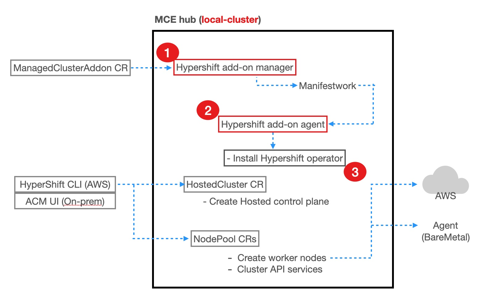

# Troubleshooting

There are three parts in the HyperShift managed cluster addon. 



### 1. HyperShift addon manager

Its main job is to install the hypershift addon agent on the `local-cluster`. It creates manifestwork in local-cluster namespace on the hub to deliver the addon agent to the local-cluster. It has no hypershift functionality.

Logs can be found in `hypershift-addon-manager` pod in `multicluster-engine` namespace.

### 2. HyperShift addon agent controller

Its main job is to turn the `local-cluster` into hypershift hosting cluster by installing the hypershift operator. It watches for `HostedCluster` resources and creates a secret containing hosted cluster’s kubeconfig in the managed cluster's klusterlet namespace for cluster import registration.

Logs can be found in `hypershift-addon-agent` pod in `open-cluster-management-agent-addon` namespace.
The HyperShift installation logs can be found in `hypershift-install-job` pods in `open-cluster-management-agent-addon` namespace. The installation job pods remain for 48 hours and are deleted.

### 3. Hypershift  operator

This is the hypershift operator that reconciles HostedCluster and NodePools to create and manage the life-cycle of HyperShift hosted clusters.

Logs can be found in the `operator` pod in `hypershift` namespace.


## How do I manually install the local-cluster on MCE?
Apply the following YAML via `oc`:

  ```bash
  $ oc apply -f - <<EOF
  apiVersion: cluster.open-cluster-management.io/v1
  kind: ManagedCluster
  metadata:
    labels:
      local-cluster: "true"
      cloud: auto-detect
      vendor: auto-detect
    name: local-cluster
  spec:
    hubAcceptsClient: true
    leaseDurationSeconds: 60
  EOF
  ```

## How do I manually install or delete the Hypershift Add-on?
Run the following `oc` command:

  ```bash
  $ oc apply -f - <<EOF
  apiVersion: addon.open-cluster-management.io/v1alpha1
  kind: ManagedClusterAddOn
  metadata:
    name: hypershift-addon
    namespace: local-cluster
  spec:
    installNamespace: open-cluster-management-agent-addon
  EOF
  ```
For deleting, do `oc delete` instead.

## How do I create the hypershift infrastructure and IAM pieces separately?
1. Set the additional variables to save each part:

    ```bash
    export INFRA_OUTPUT_FILE=$HOME/hostedcluster_infra.json
    export IAM_OUTPUT_FILE=$HOME/hostedcluster_iam.json
    ```

2. Create the infrastructure:

    ```bash
    $ hypershift create infra aws --name $CLUSTER_NAME \
        --aws-creds $AWS_CREDS \
        --base-domain $BASE_DOMAIN \
        --infra-id $CLUSTER_NAME \
        --region $REGION \
        --output-file $INFRA_OUTPUT_FILE
    ```

3. In order to create the related IAM pieces, we'll need some info from the infra output.

    ```bash
    $ cat $INFRA_OUTPUT_FILE                                                                                          
    {
      "region": "us-east-1",
      "zone": "",
      "infraID": "clc-dhu-hs1",
      "machineCIDR": "10.0.0.0/16",
      "vpcID": "vpc-07541ba034d5a26a1",
      "zones": [
        {
          "name": "us-east-1a",
          "subnetID": "subnet-0e17ee93963c8bf34"
        }
      ],
      "securityGroupID": "sg-0da668fbe75efeb43",
      "Name": "clc-dhu-hs1",
      "baseDomain": "dev09.red-chesterfield.com",
      "publicZoneID": "Z00953301HRDK0M0YKQGE",
      "privateZoneID": "Z02815081BZYZVASX5HII",
      "localZoneID": "Z01446842N9Z8MWQL967F",
      "proxyAddr": ""
    }
    ```

Specically, we'll need the `publicZoneID`, `privateZoneID`, and `localZoneID`. 
You can pipe this data to the next step in order to save time.

4. Create the IAM:

    ```bash
    $ hypershift create iam aws --infra-id $CLUSTER_NAME \
        --aws-creds $AWS_CREDS \
        --oidc-storage-provider-s3-bucket-name $BUCKET_NAME \
        --oidc-storage-provider-s3-region $BUCKET_REGION \
        --region $REGION \
        --public-zone-id Z00953301HRDK0M0YKQGE \
        --private-zone-id Z02815081BZYZVASX5HII \
        --local-zone-id Z01446842N9Z8MWQL967F \
        --output-file $IAM_OUTPUT_FILE
    ```

5. We can now use the `hypershift create cluster aws` command to create our hosted cluster. We can specify the infrastructure and IAM pieces as arguments via `--infra-json` and `--iam-json`:

    ```bash
    $ hypershift create cluster aws \
        --name $CLUSTER_NAME \
        --infra-id $INFRA_ID \
        --infra-json $INFRA_OUTPUT_FILE \
        --iam-json $IAM_OUTPUT_FILE \
        --aws-creds $AWS_CREDS \
        --pull-secret $PULL_SECRET \
        --region $REGION \
        --generate-ssh \
        --node-pool-replicas 3 \
        --namespace local-cluster
    ```

For more options when interacting with the CLI, refer to [Hypershift Project Documentation for creating a HostedCluster](https://hypershift-docs.netlify.app/getting-started/#create-a-hostedcluster).

That's all! Your hosted cluster is now created. Refer to the main section above for importing the cluster into MCE/ACM.

Check the status of your hosted cluster via:

    ```bash
    $ oc get hostedclusters -n local-cluster
    ```
## How do I recreate a managed cluster resource if it's deleted by accident?
If a managed cluster resource is deleted by accident, it is possible to create it again to re-import the managed cluster into MCE, as long as the hosted cluster still exists. When a managed cluster resource is deleted, the credentials for the hosted cluster are removed from the hub cluster as well. These credentials need to be recreated before the managed cluster resource could be created.

To recreate the credentials for the hosted cluster, add an annotation to the hosted cluster:
    ```bash
    $ oc annotate hostedcluster $CLUSTER_NAME recreate=true 
    ```

The hosted cluster could now be imported into MCE again, either using the CLI or the console.

## How do I configure the `hypershift-addon` managed cluster addon to run in an infrastructure node?

1. Log into the hub cluster.

2. Edit `hypershift-addon-deploy-config` AddOnDeploymentConfig.

```bash
$ oc edit addondeploymentconfig hypershift-addon-deploy-config -n multicluster-engine
```

3. Add `nodePlacement` to the spec as shown in the example below and save the changes. This will automatically deploy the hypershift-addon managed cluster addons on an infrastructure node for new and existing managed clusters.

```yaml
apiVersion: addon.open-cluster-management.io/v1alpha1
kind: AddOnDeploymentConfig
metadata:
  name: hypershift-addon-deploy-config
  namespace: multicluster-engine
spec:
  nodePlacement:
    nodeSelector:
      node-role.kubernetes.io/infra: ""
    tolerations:
    - effect: NoSchedule
      key: node-role.kubernetes.io/infra
      operator: Exists 
```

