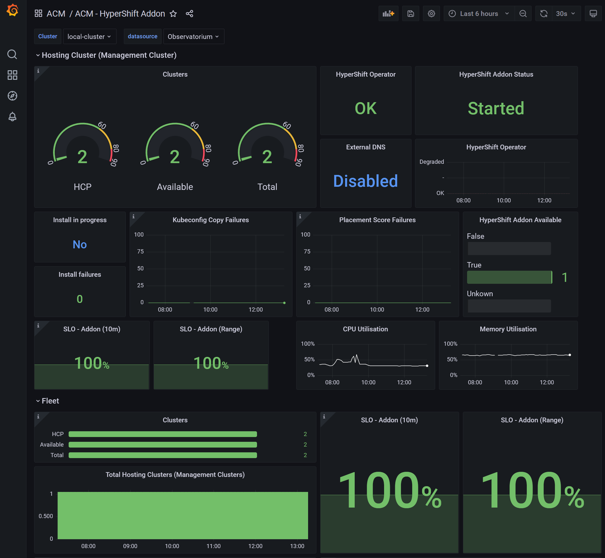

# Hypershift Addon Dashboard
  
## INSTALL
1. Make sure you enable ACM Observability, [instructions here](https://access.redhat.com/documentation/en-us/red_hat_advanced_cluster_management_for_kubernetes/2.6/html/observability/observing-environments-intro#enable-observability)
2. Apply the `allow list` yaml(this makes the HyperShift Addon metrics available to Grafana dashboards) and the dashboard yaml:
    ```bash
    oc apply -f ./hypershift-addon-allow-list.yaml -f ./hypershift-addon-dashboard.yaml
    ```

## VIEW THE DASHBOARD
1. Go to the Grafana dashboards via the Infrastructure > Cluster List view (top right side)
2. Look in the ACM folder for the `ACM - HyperShift Addon` dashboard